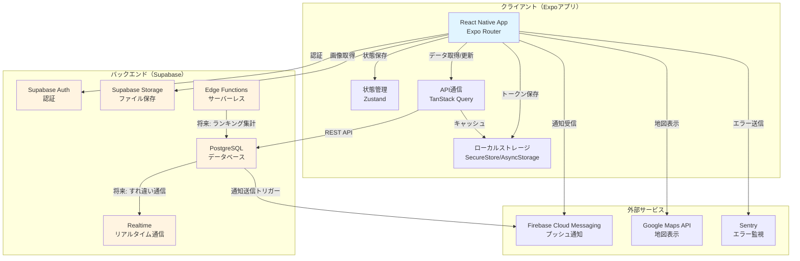

# デリモン アーキテクチャ設計

## 1. 技術スタック

### フロントエンド
- **フレームワーク**: Expo SDK 52以降
- **言語**: TypeScript 5.3+
- **プラットフォーム**: React Native 0.76+
- **UI ライブラリ**: React Native Paper 5.12+
- **ナビゲーション**: Expo Router 4.0+ (ファイルベースルーティング)

### バックエンド
- **サービス**: Supabase
- **API**: REST（Supabase自動生成）
- **サーバーレス関数**: Supabase Edge Functions（将来機能で使用）

### データベース
- **メインDB**: PostgreSQL（Supabase）
- **ローカルストレージ**: expo-secure-store（認証トークン）、AsyncStorage（キャッシュ）

### 認証
- **サービス**: Supabase Auth
- **認証方法**: 
  - MVP: Email/Password
  - 将来: Google/Apple ログイン

### インフラ
- **ホスティング**: Supabase（バックエンド）
- **ストレージ**: 
  - MVP: アプリ内埋め込み（キャラクター画像9枚）
  - 将来: Supabase Storage（新キャラクター追加時）
- **ビルド**: EAS Build（クラウドビルド）
- **開発環境**: Expo Go（初期）、Development Build（GPS機能開発時）

### その他
- **状態管理**: Zustand 5.0+
- **API通信**: TanStack Query (React Query) 5.59+
- **地図表示**: react-native-maps 1.18+
- **GPS・位置情報**: expo-location 18.0+ + expo-task-manager 12.0+
- **グラフ表示**: react-native-chart-kit 6.12+
- **プッシュ通知**: expo-notifications 0.29+ (Firebase Cloud Messaging)
- **音声読み上げ**: expo-speech 12.0+（将来機能）
- **エラー監視**: Sentry 5.33+

---

## 2. システム構成図



---

## 3. ディレクトリ構造

```
deliverymon/
├── app/                          # Expo Router（画面）
│   ├── (auth)/                  # 認証関連画面グループ
│   │   ├── login.tsx
│   │   ├── signup.tsx
│   │   ├── profile-setup.tsx    # ⭐NEW プロフィール設定
│   │   └── character-select.tsx
│   ├── (tabs)/                  # タブナビゲーション
│   │   ├── _layout.tsx          # タブレイアウト
│   │   ├── index.tsx            # ホーム画面
│   │   ├── delivery.tsx         # 配送（地図）画面
│   │   ├── collection.tsx       # 図鑑画面
│   │   └── history.tsx          # 履歴画面
│   ├── settings/                # 設定関連
│   │   ├── index.tsx            # 設定メニュー
│   │   ├── profile-edit.tsx     # ⭐NEW プロフィール編集
│   │   ├── privacy.tsx          # プライバシーポリシー
│   │   └── terms.tsx            # 利用規約
│   ├── tutorial.tsx             # チュートリアル画面
│   ├── evolution.tsx            # 進化アニメーション画面
│   └── _layout.tsx              # ルートレイアウト
│
├── src/
│   ├── components/              # 再利用可能なコンポーネント
│   │   ├── common/             # 汎用コンポーネント
│   │   │   ├── Button.tsx
│   │   │   ├── Card.tsx
│   │   │   ├── Loading.tsx
│   │   │   └── ErrorMessage.tsx
│   │   └── features/           # 機能固有コンポーネント
│   │       ├── character/      # キャラクター関連
│   │       │   ├── CharacterCard.tsx
│   │       │   ├── ExperienceBar.tsx
│   │       │   └── EvolutionAnimation.tsx
│   │       ├── profile/        # ⭐NEW プロフィール関連
│   │       │   ├── ProfileForm.tsx
│   │       │   └── BirthDateInput.tsx
│   │       ├── delivery/       # 配送関連
│   │       │   ├── MapView.tsx
│   │       │   ├── TrackingButton.tsx
│   │       │   └── DistanceDisplay.tsx
│   │       └── history/        # 履歴関連
│   │           ├── DistanceChart.tsx
│   │           └── StatsSummary.tsx
│   │
│   ├── hooks/                   # カスタムフック
│   │   ├── useAuth.ts          # 認証関連
│   │   ├── useProfile.ts       # ⭐NEW プロフィール管理
│   │   ├── useCharacter.ts     # キャラクター管理
│   │   ├── useDelivery.ts      # 配送セッション管理
│   │   └── useLocation.ts      # GPS・位置情報
│   │
│   ├── services/                # 外部サービス連携
│   │   ├── supabase/           # Supabase関連
│   │   │   ├── client.ts       # Supabaseクライアント
│   │   │   ├── auth.ts         # 認証API
│   │   │   ├── profile.ts      # ⭐NEW プロフィールAPI
│   │   │   ├── character.ts    # キャラクターAPI
│   │   │   ├── delivery.ts     # 配送API
│   │   │   └── user.ts         # ユーザーAPI
│   │   ├── location/           # GPS・位置情報
│   │   │   ├── tracking.ts     # バックグラウンド追跡
│   │   │   └── distance.ts     # 距離計算
│   │   └── notifications/      # プッシュ通知
│   │       └── push.ts
│   │
│   ├── store/                   # Zustand（状態管理）
│   │   ├── authStore.ts        # 認証状態
│   │   ├── profileStore.ts     # ⭐NEW プロフィール状態
│   │   ├── characterStore.ts   # キャラクター状態
│   │   └── deliveryStore.ts    # 配送状態
│   │
│   ├── utils/                   # ユーティリティ関数
│   │   ├── calculate.ts        # 経験値・レベル計算
│   │   ├── format.ts           # データフォーマット
│   │   ├── validation.ts       # バリデーション（⭐プロフィールバリデーション追加）
│   │   └── displayId.ts        # ⭐NEW 識別番号生成
│   │
│   ├── types/                   # TypeScript型定義
│   │   ├── database.ts         # DB型定義（⭐プロフィールテーブル追加）
│   │   ├── profile.ts          # ⭐NEW プロフィール型
│   │   ├── character.ts        # キャラクター型
│   │   └── delivery.ts         # 配送型
│   │
│   ├── constants/               # 定数
│   │   ├── characters.ts       # キャラクターデータ
│   │   ├── experience.ts       # 経験値テーブル
│   │   ├── profile.ts          # ⭐NEW プロフィール定数（性別・業種選択肢）
│   │   └── config.ts           # アプリ設定
│   │
│   └── lib/                     # ライブラリ設定
│       ├── sentry.ts           # Sentry初期化
│       └── queryClient.ts      # TanStack Query設定
│
├── assets/                      # 静的ファイル
│   ├── images/                 # 画像
│   │   ├── characters/         # キャラクター画像
│   │   │   ├── hakoboo-1.png  # ハコブー（1段階）
│   │   │   ├── hakoboo-2.png  # ハコブー（2段階）
│   │   │   ├── hakoboo-3.png  # ハコブー（3段階）
│   │   │   ├── rooton-1.png   # ルートン（1段階）
│   │   │   ├── rooton-2.png   # ルートン（2段階）
│   │   │   ├── rooton-3.png   # ルートン（3段階）
│   │   │   ├── shirun-1.png   # シールン（1段階）
│   │   │   ├── shirun-2.png   # シールン（2段階）
│   │   │   └── shirun-3.png   # シールン（3段階）
│   │   ├── icons/              # アイコン
│   │   ├── effects/            # エフェクト（進化用の光など）
│   │   └── tutorial/           # チュートリアル画像
│   ├── fonts/                  # フォント
│   └── sounds/                 # 効果音（将来）
│
├── __tests__/                   # テストファイル（将来）
├── .env                         # 環境変数（Git管理外）
├── .env.example                 # 環境変数のサンプル
├── .gitignore                   # Git除外ファイル
├── app.json                     # Expo設定
├── eas.json                     # EAS Build設定
├── package.json                 # 依存関係
└── tsconfig.json                # TypeScript設定
```

---

## 4. 状態管理

### グローバルステート管理（Zustand）

#### 管理する状態
**authStore（認証状態）:**
```typescript
{
  user: User | null,
  session: Session | null,
  isLoading: boolean,
  login: (email, password) => Promise<void>,
  logout: () => Promise<void>,
  signup: (email, password) => Promise<void>
}
```

**profileStore（プロフィール状態）:** ⭐NEW
```typescript
{
  profile: UserProfile | null,
  isLoading: boolean,
  hasProfile: boolean,
  fetchProfile: () => Promise<void>,
  updateProfile: (data: ProfileData) => Promise<void>
}

type UserProfile = {
  id: string;
  email: string;
  nickname: string;
  display_id: string;
  display_name: string; // "nickname#display_id"
  birth_date: string;
  gender: 'male' | 'female' | 'prefer_not_to_say';
  occupation: string;
}
```

**characterStore（キャラクター状態）:**
```typescript
{
  character: Character | null,
  experience: number,
  level: number,
  evolutionStage: 1 | 2 | 3,
  isLoading: boolean,
  addExperience: (distance: number) => void,
  evolveCharacter: () => void
}
```

**deliveryStore（配送状態）:**
```typescript
{
  isTracking: boolean,
  currentSession: DeliverySession | null,
  distance: number,
  startTracking: () => Promise<void>,
  stopTracking: () => Promise<void>
}
```

#### 選択理由
- 軽量（2KB）
- シンプルなAPI
- TypeScriptサポートが強い
- 学習コストが低い

---

### ローカルストレージ

#### expo-secure-store（機密情報）
**保存するデータ:**
- 認証トークン（アクセストークン、リフレッシュトークン）

**特徴:**
- iOS: Keychain
- Android: EncryptedSharedPreferences
- 自動で暗号化

#### AsyncStorage（一般的なキャッシュ）
**保存するデータ:**
- ユーザー設定
- キャラクター情報のキャッシュ
- 配送履歴のキャッシュ

**特徴:**
- 暗号化なし
- 高速アクセス

---

### サーバーステート管理（TanStack Query）

#### 用途
- API通信結果のキャッシュ
- 自動リフェッチ
- ローディング・エラー状態の管理

#### キャッシュ戦略
| データ | キャッシュ時間 | 更新タイミング |
|--------|---------------|----------------|
| **プロフィール情報** | **1時間** | **編集時・手動リフレッシュ** | ⭐NEW
| キャラクター情報 | 永続 | レベルアップ時のみ更新 |
| 配送履歴一覧 | 5分 | Pull-to-refresh |
| 配送セッション詳細 | なし | 常に最新取得 |
| 統計データ | 10分 | 手動リフレッシュ可 |

#### 選択理由
- APIキャッシュが自動
- ローディング・エラー処理が簡単
- サーバーステートとクライアントステートを明確に分離

---

## 5. データフロー

### 基本フロー
```
ユーザーアクション（ボタンタップ）
  ↓
画面コンポーネント（app/）
  ↓
カスタムフック（hooks/）
  ↓
TanStack Query（API通信・キャッシュ）
  ↓
Supabase Client（services/supabase/）
  ↓
Supabase（バックエンド）
  ↓
PostgreSQL（データベース）
  ↓
レスポンス
  ↓
TanStack Query（自動キャッシュ）
  ↓
Zustand（グローバル状態更新）
  ↓
画面に反映（再レンダリング）
```

### 具体例: 配送開始

```typescript
// 1. ユーザーが「配送開始」ボタンをタップ
// app/(tabs)/delivery.tsx
function DeliveryScreen() {
  const { startTracking } = useDelivery()
  
  return (
    <Button onPress={startTracking}>配送開始</Button>
  )
}

// 2. カスタムフック
// hooks/useDelivery.ts
function useDelivery() {
  const mutation = useMutation({
    mutationFn: async () => {
      await startLocationTracking()
      return await createDeliverySession()
    },
    onSuccess: (session) => {
      deliveryStore.setState({ 
        isTracking: true,
        currentSession: session 
      })
    }
  })
  
  return { startTracking: mutation.mutate }
}

// 3. サービス層（GPS追跡開始）
// services/location/tracking.ts
async function startLocationTracking() {
  await Location.startLocationUpdatesAsync('DELIVERY_TRACKING', {
    accuracy: Location.Accuracy.High,
    distanceInterval: 10,
  })
}

// 4. サービス層（Supabaseへの保存）
// services/supabase/delivery.ts
async function createDeliverySession() {
  const { data } = await supabase
    .from('delivery_sessions')
    .insert({ 
      user_id: userId,
      started_at: new Date(),
      status: 'in_progress'
    })
    .select()
    .single()
  
  return data
}
```

### 具体例: プロフィール設定 ⭐NEW

```typescript
// 1. ユーザーがプロフィール設定フォームを送信
// app/(auth)/profile-setup.tsx
function ProfileSetupScreen() {
  const { updateProfile } = useProfile()
  const [formData, setFormData] = useState({
    nickname: '',
    birth_date: '',
    gender: 'prefer_not_to_say',
    occupation: 'other'
  })
  
  const handleSubmit = () => {
    updateProfile(formData)
  }
  
  return (
    <View>
      <TextInput 
        value={formData.nickname}
        onChangeText={(text) => setFormData({ ...formData, nickname: text })}
      />
      {/* 他のフィールド */}
      <Button onPress={handleSubmit}>完了</Button>
    </View>
  )
}

// 2. カスタムフック
// hooks/useProfile.ts
function useProfile() {
  const mutation = useMutation({
    mutationFn: async (profileData: ProfileData) => {
      // バリデーション
      validateProfile(profileData)
      
      // 識別番号を生成してプロフィール保存
      return await createOrUpdateProfile(profileData)
    },
    onSuccess: (profile) => {
      profileStore.setState({ 
        profile,
        hasProfile: true 
      })
      // ホーム画面へ遷移
      router.replace('/(tabs)')
    }
  })
  
  return { updateProfile: mutation.mutate }
}

// 3. バリデーション
// utils/validation.ts
function validateProfile(data: ProfileData) {
  if (data.nickname.length < 2 || data.nickname.length > 20) {
    throw new Error('ニックネームは2〜20文字で入力してください')
  }
  if (!/^[a-zA-Z0-9ぁ-んァ-ヶー一-龠々_-]+$/.test(data.nickname)) {
    throw new Error('使用できない文字が含まれています')
  }
  // 他のバリデーション
}

// 4. 識別番号生成
// utils/displayId.ts
async function generateUniqueDisplayId(nickname: string): Promise<string> {
  let displayId: string
  let exists = true
  
  while (exists) {
    displayId = Math.floor(Math.random() * 9999).toString().padStart(4, '0')
    
    const { data } = await supabase
      .from('users')
      .select('id')
      .eq('nickname', nickname)
      .eq('display_id', displayId)
      .single()
    
    exists = !!data
  }
  
  return displayId!
}

// 5. サービス層（Supabaseへの保存）
// services/supabase/profile.ts
async function createOrUpdateProfile(profileData: ProfileData) {
  const user = await supabase.auth.getUser()
  
  // 既存プロフィールチェック
  const { data: existing } = await supabase
    .from('users')
    .select('display_id')
    .eq('id', user.id)
    .single()
  
  let displayId: string
  if (!existing || !existing.display_id) {
    // 初回設定: 識別番号を生成
    displayId = await generateUniqueDisplayId(profileData.nickname)
  } else {
    // 編集: 既存の識別番号を維持
    displayId = existing.display_id
  }
  
  // プロフィール保存
  const { data } = await supabase
    .from('users')
    .update({
      nickname: profileData.nickname,
      display_id: displayId,
      birth_date: profileData.birth_date,
      gender: profileData.gender,
      occupation: profileData.occupation
    })
    .eq('id', user.id)
    .select()
    .single()
  
  return {
    ...data,
    display_name: `${data.nickname}#${data.display_id}`
  }
}
```

### オフライン対応

#### 閲覧可能（キャッシュから表示）
- ホーム画面（キャラクター、経験値、**ニックネーム**） ⭐UPDATED
- 図鑑画面
- 過去の配送履歴
- 統計データ
- **プロフィール表示**（キャッシュから） ⭐NEW

#### オフライン不可
- GPS計測（位置情報サービスが必要）
- 新規ログイン・サインアップ
- **プロフィール編集**（サーバー通信が必要） ⭐NEW
- データの作成・更新

#### 同期戦略
- オンライン復帰時に自動リフレッシュ
- TanStack Queryの`refetchOnReconnect`を有効化

---

## 6. セキュリティ設計

### APIキー・環境変数の管理

#### .env ファイル
```bash
# .env（Git管理外）
EXPO_PUBLIC_SUPABASE_URL=https://xxxxx.supabase.co
EXPO_PUBLIC_SUPABASE_ANON_KEY=eyJhbGciOiJIUzI1NiIsInR5cCI6IkpXVCJ9...
EXPO_PUBLIC_GOOGLE_MAPS_API_KEY=AIzaSyXXXXXXXXXXXX

SENTRY_DSN=https://xxxxx@sentry.io/xxxxx
```

#### .env.example（Gitにコミット）
```bash
# .env.example
EXPO_PUBLIC_SUPABASE_URL=your_supabase_url
EXPO_PUBLIC_SUPABASE_ANON_KEY=your_anon_key
EXPO_PUBLIC_GOOGLE_MAPS_API_KEY=your_google_maps_key

SENTRY_DSN=your_sentry_dsn
```

#### EAS Secrets（本番環境）
```bash
# EAS Build時の環境変数設定
eas secret:create --scope project --name EXPO_PUBLIC_SUPABASE_URL --value "https://xxxxx.supabase.co"
eas secret:create --scope project --name EXPO_PUBLIC_SUPABASE_ANON_KEY --value "eyJhbGci..."
```

---

### 認証トークン管理

#### 保存場所
**expo-secure-store**を使用
- iOS: Keychain
- Android: EncryptedSharedPreferences

```typescript
import * as SecureStore from 'expo-secure-store';

// トークン保存
await SecureStore.setItemAsync('auth_token', token);

// トークン取得
const token = await SecureStore.getItemAsync('auth_token');

// トークン削除
await SecureStore.deleteItemAsync('auth_token');
```

#### トークンの有効期限
- **アクセストークン**: 1時間
- **リフレッシュトークン**: 30日
- **自動更新**: Supabaseクライアントが自動でリフレッシュ

---

### パスワードポリシー
- **最小文字数**: 8文字
- **要件**: 英数字混在（大文字小文字は問わない）
- **Supabase設定**:
```sql
-- Supabase Authの設定
-- Dashboard > Authentication > Policies
password_min_length: 8
password_require_letters: true
password_require_numbers: true
```

---

### データベースセキュリティ（Row Level Security）

#### 全テーブルにRLSを設定

```sql
-- 例: delivery_sessions テーブル
ALTER TABLE delivery_sessions ENABLE ROW LEVEL SECURITY;

-- ユーザーは自分のセッションのみ閲覧可能
CREATE POLICY "Users can view own sessions"
  ON delivery_sessions
  FOR SELECT
  USING (auth.uid() = user_id);

-- ユーザーは自分のセッションのみ作成可能
CREATE POLICY "Users can create own sessions"
  ON delivery_sessions
  FOR INSERT
  WITH CHECK (auth.uid() = user_id);

-- ユーザーは自分のセッションのみ更新可能
CREATE POLICY "Users can update own sessions"
  ON delivery_sessions
  FOR UPDATE
  USING (auth.uid() = user_id);
```

---

### 通信セキュリティ
- **HTTPS必須**: Supabaseは標準でHTTPS対応
- **証明書検証**: React Nativeの標準機能で自動検証

---

### データ収集の同意取得

#### サインアップ時（必須）
```typescript
<Checkbox 
  value={agreedToDataCollection}
  onValueChange={setAgreedToDataCollection}
/>
<Text>
  位置情報データの収集に同意します
  （プライバシーポリシーを参照）
</Text>

<Button 
  disabled={!agreedToDataCollection}
  onPress={handleSignup}
>
  登録
</Button>
```

#### 設定画面でのオプトアウト（任意）
```typescript
<Switch
  value={dataCollectionEnabled}
  onValueChange={handleToggleDataCollection}
/>
<Text>位置情報データの収集</Text>
<Text style={styles.note}>
  オフにすると、将来のデータ分析機能が利用できなくなります。
  過去に収集されたデータは保持されます。
</Text>
```

---

### プライバシーポリシー・利用規約
- **作成方法**: 無料テンプレートを使用
- **作成時期**: 実装中に作成
- **必須記載事項**:
  - 収集するデータ（メールアドレス、位置情報、走行距離）
  - 利用目的
  - 第三者提供の有無（将来のB2Bデータ提供について明記）
  - オプトアウトの方法
  - データ削除の方法（アカウント削除）
  - 問い合わせ先

---

## 7. エラーハンドリング・ロギング

### エラー監視（Sentry）

#### 導入タイミング
- **実装開始時から導入**

#### 記録するエラー
- JavaScriptエラー
- ネットワークエラー
- アプリクラッシュ
- GPS関連エラー

#### 設定
```typescript
// src/lib/sentry.ts
import * as Sentry from '@sentry/react-native';

Sentry.init({
  dsn: process.env.SENTRY_DSN,
  environment: __DEV__ ? 'development' : 'production',
  tracesSampleRate: 1.0, // 100%のトランザクションを記録
  enableAutoSessionTracking: true,
  beforeSend(event) {
    // 個人情報を除外
    if (event.user) {
      delete event.user.email;
    }
    return event;
  },
});
```

#### 通知設定
- 新規エラー: メール通知
- エラー率10%超: 緊急メール通知

---

### ログ収集（Firebase Analytics）

#### 記録するイベント
- ユーザーアクション（ログイン、配送開始、キャラクター選択）
- 画面遷移
- エラー（APIエラー、GPSエラー）
- パフォーマンス（画面読み込み時間）

#### 記録しないもの
- 個人情報（メールアドレス、パスワード）
- 詳細な位置情報

---

### エラーハンドリング戦略

#### ネットワークエラー
```typescript
// TanStack Queryの設定
const queryClient = new QueryClient({
  defaultOptions: {
    queries: {
      retry: 3, // 3回リトライ
      retryDelay: (attemptIndex) => Math.min(1000 * 2 ** attemptIndex, 30000), // 指数バックオフ
    },
  },
});
```

#### アプリクラッシュ
```typescript
// ErrorBoundaryでキャッチ
<ErrorBoundary fallback={<ErrorScreen />}>
  <App />
</ErrorBoundary>
```

#### GPS エラー
```typescript
try {
  await Location.requestForegroundPermissionsAsync();
} catch (error) {
  Sentry.captureException(error);
  Alert.alert(
    '位置情報の許可が必要です',
    'アプリの設定から位置情報へのアクセスを許可してください。'
  );
}
```

---

## 8. スケーラビリティ

### ユーザー数別の対応

#### フェーズ1: 〜1,000人（MVPターゲット）
**コスト**: $0/月（無料枠）

**データ量試算:**
- 1ユーザー/月: 約100KB
- 1,000ユーザー/6ヶ月: 約600MB
- **Supabase無料枠（500MB DB）内に収まる**

**対応**: そのまま

---

#### フェーズ2: 1,000〜5,000人
**コスト**: $35〜55/月

**対策:**
- Supabase有料プラン移行（$25/月）
- Google Maps APIの最適化
- 不要なクエリの削減

---

#### フェーズ3: 5,000〜10,000人（3ヶ月目標）
**コスト**: $133〜183/月

**対策:**
- データベースインデックスの追加
- 古いGPS座標データの集約（直近1ヶ月のみ詳細保存）
- CDN導入（Cloudflare）
- キャッシュ戦略の最適化

---

#### フェーズ4: 10,000人〜
**コスト**: $300/月以上

**対策:**
- Supabaseシャーディング
- 専用サーバー検討（AWS/GCP）
- マイクロサービス化
- チーム化

---

### ボトルネックと対策

#### データベース容量
**ボトルネック**: 500MB（無料枠）

**対策:**
- MVP: 全期間シンプルに保存
- 1,000人超: 古いGPS座標を削除、集約データのみ保持
- 5,000人超: 有料プラン移行

---

#### API同時接続数
**ボトルネック**: 50接続（無料枠）

**対策:**
- コネクションプーリング
- TanStack Queryのキャッシュ活用
- 不要なリアルタイム購読を避ける

---

#### Google Maps API
**無料枠**: 月間28,000マップ読み込み

**1,000ユーザーの場合:**
- 1ユーザー × 月20回配送 = 20,000マップ読み込み
- **ギリギリ無料枠内**

**超過後**: $7/1,000リクエスト

**対策:**
- マップのキャッシュ
- 必要時のみ読み込み（配送画面表示時のみ）

---

## 9. 技術選定理由

### Expo
**メリット:**
- 初心者に優しい、セットアップが簡単
- クラウドビルド（EAS Build）でMacなしでも開発可能
- バックグラウンドGPS対応

**デメリット:**
- 一部のネイティブ機能に制約（このプロジェクトでは問題なし）

**選択理由**: 初心者 + 個人開発 + 2ヶ月という期限に最適

---

### TypeScript
**メリット:**
- 型安全性でバグを事前に防ぐ
- エディタの補完が強力
- 大規模化しても保守しやすい

**デメリット:**
- 学習コスト（ただしClaude Codeがサポート）

**選択理由**: 長期的な保守性を重視

---

### Supabase
**メリット:**
- 無料枠が大きい（1,000ユーザーまで十分）
- PostgreSQL（高機能なDB）
- 認証・ストレージが統合
- リアルタイム機能（将来のすれ違い通信で使用）

**デメリット:**
- Firebaseより新しい（ただし安定している）

**選択理由**: 個人開発に最適、将来の拡張性も考慮

---

### Zustand
**メリット:**
- 軽量（2KB）
- シンプルなAPI
- 学習コストが低い
- TypeScriptサポートが強い

**デメリット:**
- Reduxほど高機能ではない（このプロジェクトでは問題なし）

**選択理由**: 個人開発の規模に最適

---

### TanStack Query
**メリット:**
- APIキャッシュが自動
- ローディング・エラー処理が簡単
- サーバーステートとクライアントステートを分離

**デメリット:**
- 学習コスト（ただしドキュメントが充実）

**選択理由**: API通信の複雑さを大幅に削減

---

### React Native Paper
**メリット:**
- Material Design準拠
- Expoと相性が良い
- 豊富なコンポーネント

**デメリット:**
- デザインのカスタマイズ性がやや低い

**選択理由**: 初心者向け、MVPには十分

---

### Sentry
**メリット:**
- 無料枠で十分（月5,000エラー）
- エラー情報が詳細
- Expoと統合が簡単

**デメリット:**
- 有料プランは高額（個人開発では不要）

**選択理由**: リリース後のバグ修正が圧倒的に楽

---

## 10. 初期コスト（月額）

### フェーズ1: 〜1,000人（MVPターゲット）
| サービス | プラン | コスト |
|---------|--------|--------|
| Supabase | 無料枠 | $0 |
| Google Maps API | 無料枠 | $0 |
| Firebase (FCM) | 無料 | $0 |
| Sentry | 無料枠 | $0 |
| EAS Build | 無料枠 | $0 |
| **合計** | | **$0/月** |

### フェーズ2: 1,000〜5,000人
| サービス | プラン | コスト |
|---------|--------|--------|
| Supabase | Pro | $25 |
| Google Maps API | 従量課金 | $10〜30 |
| その他 | 無料 | $0 |
| **合計** | | **$35〜55/月** |

### フェーズ3: 5,000〜10,000人（3ヶ月目標）
| サービス | プラン | コスト |
|---------|--------|--------|
| Supabase | Pro | $25 |
| Google Maps API | 従量課金 | $50〜100 |
| Sentry | 有料 | $29 |
| EAS Build | 有料 | $29 |
| **合計** | | **$133〜183/月** |

---

## 11. パフォーマンス目標

### レスポンス時間
- **アプリ起動**: 3秒以内
- **画面遷移**: 500ms以内
- **地図読み込み**: 2秒以内
- **API応答**: 1秒以内

### MVP時点の方針
- 基本的な実装のみ、極端に遅くなければOK
- パフォーマンス測定はテスト時に実施
- 問題があれば最適化

### 将来の最適化手法
- **画像**: WebP形式、遅延読み込み
- **リスト**: 仮想化（FlatList）
- **バンドルサイズ**: コード分割
- **データベース**: インデックス追加
- **キャッシュ**: TanStack Queryの活用

---

## 12. 主要ライブラリ一覧

### 依存関係
```json
{
  "dependencies": {
    "expo": "~52.0.0",
    "expo-router": "~4.0.0",
    "react": "18.3.1",
    "react-native": "0.76.0",
    
    "@supabase/supabase-js": "^2.45.0",
    "@tanstack/react-query": "^5.59.0",
    "zustand": "^5.0.0",
    
    "react-native-maps": "1.18.0",
    "expo-location": "~18.0.0",
    "expo-task-manager": "~12.0.0",
    
    "react-native-paper": "^5.12.0",
    "@react-navigation/native": "^6.1.0",
    
    "react-native-chart-kit": "^6.12.0",
    "expo-notifications": "~0.29.0",
    "expo-secure-store": "~14.0.0",
    "expo-speech": "~12.0.0",
    
    "@sentry/react-native": "~5.33.0"
  },
  "devDependencies": {
    "@types/react": "~18.3.0",
    "typescript": "^5.3.0"
  }
}
```

### 選定基準
- メンテナンスが活発（直近3ヶ月以内に更新）
- GitHub Star数が多い（1,000以上）
- TypeScript対応
- ドキュメントが充実
- Expoとの互換性

---

## 13. 開発ワークフロー

### バージョン管理（Git）

#### ブランチ戦略（シンプル版）
```
main          # 本番リリース用（常に安定）
└─ develop   # 開発中の最新
   └─ feature/xxx  # 機能開発ブランチ
```

#### ブランチ命名規則
- `feature/auth` - 認証機能
- `feature/gps` - GPS機能
- `feature/character` - キャラクター機能
- `fix/xxx` - バグ修正

#### コミットメッセージ
```
feat: ログイン機能を追加
fix: GPS計測のバグを修正
docs: READMEを更新
refactor: 経験値計算ロジックをリファクタ
```

---

### ビルド・デプロイフロー

#### 開発環境
- **ツール**: Expo Go
- **方法**: `npx expo start` → QRコードでスキャン
- **用途**: UI確認、基本機能のテスト

#### GPS機能開発
- **ツール**: Development Build
- **方法**: `eas build --profile development --platform android`
- **用途**: バックグラウンドGPSのテスト

#### 本番リリース
- **ツール**: EAS Build
- **方法**: `eas build --profile production --platform android`
- **用途**: Google Playへのアップロード

---

### CI/CD
- **MVP**: 手動ビルド（コマンド実行）
- **将来**: GitHub Actions導入を検討

---

### テスト戦略
- **MVP**: 手動テスト（実機での確認）
- **テスト内容**:
  - GPS計測の精度確認（実際に移動してテスト）
  - バッテリー消費の確認
  - バックグラウンド動作の確認
  - 画面遷移の確認
- **将来**: 重要な機能にユニットテスト追加

---

## 14. 開発スケジュール（再掲）

| フェーズ | 期間 | 内容 |
|---------|------|------|
| 要件定義・設計 | 1週間 | 要件定義、アーキテクチャ設計、DB設計、API設計 |
| 環境構築 | 3日 | Expo、Supabaseセットアップ |
| 認証実装 | 1週間 | ログイン、サインアップ |
| チュートリアル・キャラ選択 | 3日 | UI実装 |
| GPS計測機能 | 1.5週間 | バックグラウンドGPS追跡、距離計算 |
| 経験値・レベルシステム | 1週間 | ロジック実装 |
| 図鑑・履歴画面 | 1週間 | UI + グラフ表示 |
| プッシュ通知 | 3日 | FCM連携 |
| 設定機能 | 3日 | 各種設定項目 |
| テスト・バグ修正 | 1週間 | 実地テスト（実機での走行テスト） |
| ストア申請準備 | 3日 | スクリーンショット、説明文など |
| **合計** | **約7.5週間（2ヶ月弱）** | MVP完成まで |
