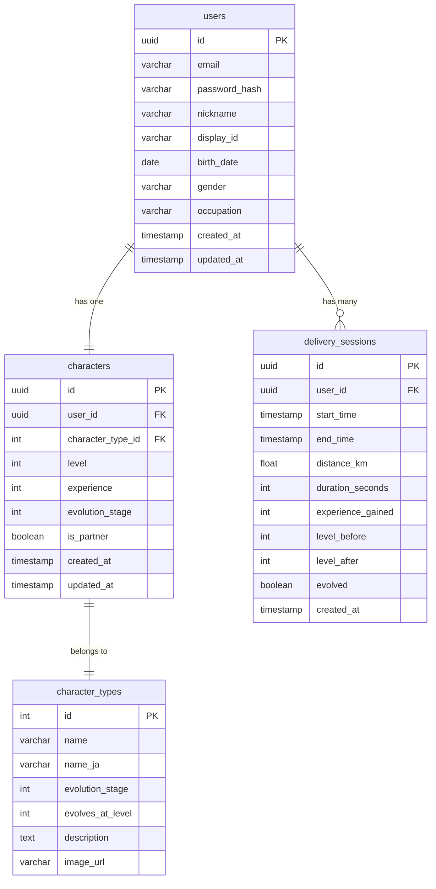

# デリモン - データベース設計書（プロフィール設定追加版）

**バージョン**: 1.1  
**最終更新日**: 2025年11月6日  
**作成者**: [名前]  
**ステータス**: 設計中

---

## 変更履歴

| 日付 | バージョン | 変更内容 | 担当者 |
|------|-----------|---------|--------|
| 2025-11-06 | 1.1 | プロフィール関連カラムをusersテーブルに追加 | [名前] |
| 2025-11-06 | 1.0 | 初版作成 | [名前] |

---

## 1. 概要

本ドキュメントは、デリモンアプリのデータベース設計を定義します。

**使用データベース**: Supabase (PostgreSQL)  
**認証**: Supabase Auth

---

## 2. データベース構成図



---

## 3. テーブル定義

### 3.1 users（ユーザー）⭐UPDATED

ユーザーアカウント情報とプロフィール情報を管理。

| カラム名 | 型 | NULL | デフォルト | 説明 |
|---------|-----|------|-----------|------|
| id | UUID | NOT NULL | gen_random_uuid() | ユーザーID（主キー） |
| email | VARCHAR(255) | NOT NULL | - | メールアドレス（一意） |
| password_hash | VARCHAR(255) | NOT NULL | - | パスワードハッシュ |
| **nickname** | **VARCHAR(20)** | **NOT NULL** | **-** | **ニックネーム（表示用、2-20文字）** ⭐NEW |
| **display_id** | **VARCHAR(4)** | **NOT NULL** | **-** | **4桁識別番号（0001-9999）** ⭐NEW |
| **birth_date** | **DATE** | **NOT NULL** | **-** | **生年月日** ⭐NEW |
| **gender** | **VARCHAR(20)** | **NOT NULL** | **-** | **性別（male/female/prefer_not_to_say）** ⭐NEW |
| **occupation** | **VARCHAR(50)** | **NOT NULL** | **-** | **業種** ⭐NEW |
| created_at | TIMESTAMP | NOT NULL | CURRENT_TIMESTAMP | 作成日時 |
| updated_at | TIMESTAMP | NOT NULL | CURRENT_TIMESTAMP | 更新日時 |

**制約**:
- PRIMARY KEY: `id`
- UNIQUE: `email`
- **UNIQUE: `nickname, display_id`（組み合わせで一意）** ⭐NEW
- CHECK: `email` は有効なメールアドレス形式
- **CHECK: `nickname` は2-20文字** ⭐NEW
- **CHECK: `display_id` は4桁の数字（正規表現: `^\d{4}$`）** ⭐NEW
- **CHECK: `gender` IN ('male', 'female', 'prefer_not_to_say')** ⭐NEW
- **CHECK: `occupation` IN ('truck_driver', 'light_vehicle_driver', 'food_delivery', 'cargo_ship', 'bus_taxi', 'other')** ⭐NEW

**インデックス**:
- `idx_users_email` ON `email`（一意制約により自動作成）
- **`idx_users_nickname_display_id` ON `(nickname, display_id)`（一意制約により自動作成）** ⭐NEW

**DDL**:
```sql
CREATE TABLE users (
  id UUID PRIMARY KEY DEFAULT gen_random_uuid(),
  email VARCHAR(255) UNIQUE NOT NULL,
  password_hash VARCHAR(255) NOT NULL,
  nickname VARCHAR(20) NOT NULL CHECK (char_length(nickname) BETWEEN 2 AND 20),
  display_id VARCHAR(4) NOT NULL CHECK (display_id ~ '^\d{4}$'),
  birth_date DATE NOT NULL,
  gender VARCHAR(20) NOT NULL CHECK (gender IN ('male', 'female', 'prefer_not_to_say')),
  occupation VARCHAR(50) NOT NULL CHECK (occupation IN ('truck_driver', 'light_vehicle_driver', 'food_delivery', 'cargo_ship', 'bus_taxi', 'other')),
  created_at TIMESTAMP DEFAULT CURRENT_TIMESTAMP NOT NULL,
  updated_at TIMESTAMP DEFAULT CURRENT_TIMESTAMP NOT NULL,
  UNIQUE (nickname, display_id)
);

-- 更新日時の自動更新トリガー
CREATE OR REPLACE FUNCTION update_updated_at_column()
RETURNS TRIGGER AS $$
BEGIN
  NEW.updated_at = CURRENT_TIMESTAMP;
  RETURN NEW;
END;
$$ language 'plpgsql';

CREATE TRIGGER update_users_updated_at BEFORE UPDATE ON users
FOR EACH ROW EXECUTE FUNCTION update_updated_at_column();
```

**サンプルデータ**:
```sql
INSERT INTO users (email, password_hash, nickname, display_id, birth_date, gender, occupation) VALUES
('tanaka@example.com', '$2a$10$...hash...', 'たなか', '1234', '1990-06-25', 'male', 'truck_driver'),
('sato@example.com', '$2a$10$...hash...', 'さとう', '5678', '1985-03-15', 'female', 'food_delivery'),
('suzuki@example.com', '$2a$10$...hash...', 'Suzuki', '9012', '1995-12-01', 'prefer_not_to_say', 'light_vehicle_driver');
```

---

### 3.2 characters（キャラクター）

ユーザーが所持するキャラクター情報を管理。

| カラム名 | 型 | NULL | デフォルト | 説明 |
|---------|-----|------|-----------|------|
| id | UUID | NOT NULL | gen_random_uuid() | キャラクターID（主キー） |
| user_id | UUID | NOT NULL | - | ユーザーID（外部キー） |
| character_type_id | INT | NOT NULL | - | キャラクタータイプID（外部キー） |
| level | INT | NOT NULL | 1 | レベル |
| experience | INT | NOT NULL | 0 | 現在の経験値 |
| evolution_stage | INT | NOT NULL | 1 | 進化段階（1-3） |
| is_partner | BOOLEAN | NOT NULL | false | 相棒かどうか |
| created_at | TIMESTAMP | NOT NULL | CURRENT_TIMESTAMP | 作成日時 |
| updated_at | TIMESTAMP | NOT NULL | CURRENT_TIMESTAMP | 更新日時 |

**制約**:
- PRIMARY KEY: `id`
- FOREIGN KEY: `user_id` REFERENCES `users(id)` ON DELETE CASCADE
- FOREIGN KEY: `character_type_id` REFERENCES `character_types(id)`
- CHECK: `level >= 1`
- CHECK: `experience >= 0`
- CHECK: `evolution_stage` IN (1, 2, 3)
- UNIQUE: `(user_id, character_type_id)`（MVPでは1ユーザー1キャラクター）

**インデックス**:
- `idx_characters_user_id` ON `user_id`
- `idx_characters_is_partner` ON `is_partner`

**DDL**:
```sql
CREATE TABLE characters (
  id UUID PRIMARY KEY DEFAULT gen_random_uuid(),
  user_id UUID NOT NULL REFERENCES users(id) ON DELETE CASCADE,
  character_type_id INT NOT NULL REFERENCES character_types(id),
  level INT NOT NULL DEFAULT 1 CHECK (level >= 1),
  experience INT NOT NULL DEFAULT 0 CHECK (experience >= 0),
  evolution_stage INT NOT NULL DEFAULT 1 CHECK (evolution_stage IN (1, 2, 3)),
  is_partner BOOLEAN NOT NULL DEFAULT false,
  created_at TIMESTAMP DEFAULT CURRENT_TIMESTAMP NOT NULL,
  updated_at TIMESTAMP DEFAULT CURRENT_TIMESTAMP NOT NULL,
  UNIQUE (user_id, character_type_id)
);

CREATE INDEX idx_characters_user_id ON characters(user_id);
CREATE INDEX idx_characters_is_partner ON characters(is_partner);

CREATE TRIGGER update_characters_updated_at BEFORE UPDATE ON characters
FOR EACH ROW EXECUTE FUNCTION update_updated_at_column();
```

**サンプルデータ**:
```sql
-- ユーザーID '00000000-0000-0000-0000-000000000001' がハコブー（Lv.25、2段階目進化）を所持
INSERT INTO characters (user_id, character_type_id, level, experience, evolution_stage, is_partner) VALUES
('00000000-0000-0000-0000-000000000001', 1, 25, 500, 2, true);
```

---

### 3.3 character_types（キャラクタータイプ）

キャラクターの種類と進化情報を管理するマスターテーブル。

| カラム名 | 型 | NULL | デフォルト | 説明 |
|---------|-----|------|-----------|------|
| id | INT | NOT NULL | - | キャラクタータイプID（主キー） |
| name | VARCHAR(50) | NOT NULL | - | キャラクター名（英語） |
| name_ja | VARCHAR(50) | NOT NULL | - | キャラクター名（日本語） |
| evolution_stage | INT | NOT NULL | - | 進化段階（1-3） |
| evolves_at_level | INT | NULL | - | 次の進化レベル（NULLは最終進化） |
| description | TEXT | NOT NULL | - | 図鑑説明文 |
| image_url | VARCHAR(255) | NOT NULL | - | 画像URL |

**制約**:
- PRIMARY KEY: `id`
- CHECK: `evolution_stage` IN (1, 2, 3)
- CHECK: `evolves_at_level IS NULL OR evolves_at_level > 0`

**DDL**:
```sql
CREATE TABLE character_types (
  id INT PRIMARY KEY,
  name VARCHAR(50) NOT NULL,
  name_ja VARCHAR(50) NOT NULL,
  evolution_stage INT NOT NULL CHECK (evolution_stage IN (1, 2, 3)),
  evolves_at_level INT CHECK (evolves_at_level IS NULL OR evolves_at_level > 0),
  description TEXT NOT NULL,
  image_url VARCHAR(255) NOT NULL
);
```

**マスターデータ**:
```sql
-- ハコブー系統
INSERT INTO character_types (id, name, name_ja, evolution_stage, evolves_at_level, description, image_url) VALUES
(1, 'Hakoboo', 'ハコブー', 1, 20, '配送の相棒。箱型の体が特徴的。', '/images/characters/hakoboo_1.png'),
(2, 'Hakodon', 'ハコドン', 2, 50, 'ハコブーの進化形。より大きな荷物を運べる。', '/images/characters/hakoboo_2.png'),
(3, 'Hakojuu', 'ハコジュウ', 3, NULL, 'ハコブーの最終進化。どんな荷物でも運べる。', '/images/characters/hakoboo_3.png');

-- ルートン系統
INSERT INTO character_types (id, name, name_ja, evolution_stage, evolves_at_level, description, image_url) VALUES
(4, 'Rooton', 'ルートン', 1, 20, 'ルートを見つけるのが得意。', '/images/characters/rooton_1.png'),
(5, 'Rootodon', 'ルートドン', 2, 50, 'ルートンの進化形。最短ルートを見つける。', '/images/characters/rooton_2.png'),
(6, 'Rootokun', 'ルートクン', 3, NULL, 'ルートンの最終進化。全てのルートを知る。', '/images/characters/rooton_3.png');

-- シールン系統
INSERT INTO character_types (id, name, name_ja, evolution_stage, evolves_at_level, description, image_url) VALUES
(7, 'Sealn', 'シールン', 1, 20, 'シールを貼るのが得意。', '/images/characters/sealn_1.png'),
(8, 'Sealdon', 'シールドン', 2, 50, 'シールンの進化形。どんなシールも貼れる。', '/images/characters/sealn_2.png'),
(9, 'Sealgrand', 'シールグランド', 3, NULL, 'シールンの最終進化。伝説のシール職人。', '/images/characters/sealn_3.png');
```

---

### 3.4 delivery_sessions（配送セッション）

配送の記録を管理。

| カラム名 | 型 | NULL | デフォルト | 説明 |
|---------|-----|------|-----------|------|
| id | UUID | NOT NULL | gen_random_uuid() | 配送セッションID（主キー） |
| user_id | UUID | NOT NULL | - | ユーザーID（外部キー） |
| start_time | TIMESTAMP | NOT NULL | - | 配送開始時刻 |
| end_time | TIMESTAMP | NOT NULL | - | 配送終了時刻 |
| distance_km | FLOAT | NOT NULL | - | 走行距離（km） |
| duration_seconds | INT | NOT NULL | - | 走行時間（秒） |
| experience_gained | INT | NOT NULL | - | 獲得経験値 |
| level_before | INT | NOT NULL | - | 配送前のレベル |
| level_after | INT | NOT NULL | - | 配送後のレベル |
| evolved | BOOLEAN | NOT NULL | false | 進化したかどうか |
| created_at | TIMESTAMP | NOT NULL | CURRENT_TIMESTAMP | 作成日時 |

**制約**:
- PRIMARY KEY: `id`
- FOREIGN KEY: `user_id` REFERENCES `users(id)` ON DELETE CASCADE
- CHECK: `end_time > start_time`
- CHECK: `distance_km >= 0`
- CHECK: `duration_seconds > 0`
- CHECK: `experience_gained >= 0`
- CHECK: `level_before >= 1`
- CHECK: `level_after >= level_before`

**インデックス**:
- `idx_delivery_sessions_user_id` ON `user_id`
- `idx_delivery_sessions_created_at` ON `created_at`（履歴取得の高速化）

**DDL**:
```sql
CREATE TABLE delivery_sessions (
  id UUID PRIMARY KEY DEFAULT gen_random_uuid(),
  user_id UUID NOT NULL REFERENCES users(id) ON DELETE CASCADE,
  start_time TIMESTAMP NOT NULL,
  end_time TIMESTAMP NOT NULL CHECK (end_time > start_time),
  distance_km FLOAT NOT NULL CHECK (distance_km >= 0),
  duration_seconds INT NOT NULL CHECK (duration_seconds > 0),
  experience_gained INT NOT NULL CHECK (experience_gained >= 0),
  level_before INT NOT NULL CHECK (level_before >= 1),
  level_after INT NOT NULL CHECK (level_after >= level_before),
  evolved BOOLEAN NOT NULL DEFAULT false,
  created_at TIMESTAMP DEFAULT CURRENT_TIMESTAMP NOT NULL
);

CREATE INDEX idx_delivery_sessions_user_id ON delivery_sessions(user_id);
CREATE INDEX idx_delivery_sessions_created_at ON delivery_sessions(created_at);
```

**サンプルデータ**:
```sql
INSERT INTO delivery_sessions (user_id, start_time, end_time, distance_km, duration_seconds, experience_gained, level_before, level_after, evolved) VALUES
('00000000-0000-0000-0000-000000000001', '2025-11-06 08:00:00', '2025-11-06 12:30:00', 45.5, 16200, 4550, 3, 7, false),
('00000000-0000-0000-0000-000000000001', '2025-11-05 09:00:00', '2025-11-05 15:00:00', 52.3, 21600, 5230, 19, 20, true);
```

---

## 4. データ容量見積もり

### 4.1 想定データ量（1,000ユーザー × 3ヶ月）

**users テーブル**:
- 1レコード: 約**300 bytes**（プロフィール情報含む） ⭐UPDATED
- 1,000ユーザー: 300KB

**characters テーブル**:
- 1レコード: 約150 bytes
- 1,000ユーザー × 1キャラ: 150KB

**character_types テーブル**:
- 1レコード: 約200 bytes
- 9種類: 1.8KB

**delivery_sessions テーブル**:
- 1レコード: 約180 bytes
- 1ユーザーあたり90日 × 1セッション/日 = 90セッション
- 1,000ユーザー × 90セッション: 16.2MB

**合計**: 約**16.7MB** ⭐UPDATED

**Supabase無料枠**: 500MB → **十分余裕あり**

---

## 5. Row Level Security (RLS) ポリシー

Supabaseの行レベルセキュリティで、ユーザーは自分のデータのみアクセス可能に設定。

### 5.1 users テーブル

```sql
-- RLS有効化
ALTER TABLE users ENABLE ROW LEVEL SECURITY;

-- 自分のユーザー情報のみ閲覧可能
CREATE POLICY "Users can view their own data"
ON users FOR SELECT
USING (auth.uid() = id);

-- 自分のユーザー情報のみ更新可能（プロフィール編集用）⭐NEW
CREATE POLICY "Users can update their own profile"
ON users FOR UPDATE
USING (auth.uid() = id);
```

### 5.2 characters テーブル

```sql
ALTER TABLE characters ENABLE ROW LEVEL SECURITY;

-- 自分のキャラクターのみ閲覧可能
CREATE POLICY "Users can view their own characters"
ON characters FOR SELECT
USING (auth.uid() = user_id);

-- 自分のキャラクターのみ更新可能
CREATE POLICY "Users can update their own characters"
ON characters FOR UPDATE
USING (auth.uid() = user_id);

-- 自分のキャラクターのみ作成可能
CREATE POLICY "Users can create their own characters"
ON characters FOR INSERT
WITH CHECK (auth.uid() = user_id);
```

### 5.3 character_types テーブル

```sql
ALTER TABLE character_types ENABLE ROW LEVEL SECURITY;

-- 全ユーザーが閲覧可能（マスターデータ）
CREATE POLICY "All users can view character types"
ON character_types FOR SELECT
TO authenticated
USING (true);
```

### 5.4 delivery_sessions テーブル

```sql
ALTER TABLE delivery_sessions ENABLE ROW LEVEL SECURITY;

-- 自分の配送履歴のみ閲覧可能
CREATE POLICY "Users can view their own delivery sessions"
ON delivery_sessions FOR SELECT
USING (auth.uid() = user_id);

-- 自分の配送履歴のみ作成可能
CREATE POLICY "Users can create their own delivery sessions"
ON delivery_sessions FOR INSERT
WITH CHECK (auth.uid() = user_id);
```

---

## 6. ビュー定義

### 6.1 user_stats_view（ユーザー統計ビュー）⭐UPDATED

ユーザーごとの統計情報を提供。

```sql
CREATE OR REPLACE VIEW user_stats_view AS
SELECT 
  u.id AS user_id,
  u.nickname,
  u.display_id,
  u.email,
  -- プロフィール情報（非公開）
  u.birth_date,
  u.gender,
  u.occupation,
  -- キャラクター情報
  c.level,
  c.experience,
  c.evolution_stage,
  -- 配送統計
  COUNT(ds.id) AS total_deliveries,
  COALESCE(SUM(ds.distance_km), 0) AS total_distance_km,
  COALESCE(SUM(ds.duration_seconds), 0) AS total_duration_seconds,
  COALESCE(SUM(ds.experience_gained), 0) AS total_experience_gained,
  -- 今週の統計
  COALESCE(SUM(CASE WHEN ds.created_at >= date_trunc('week', CURRENT_DATE) THEN ds.distance_km ELSE 0 END), 0) AS week_distance_km,
  -- 今月の統計
  COALESCE(SUM(CASE WHEN ds.created_at >= date_trunc('month', CURRENT_DATE) THEN ds.distance_km ELSE 0 END), 0) AS month_distance_km,
  -- 今日の統計
  COALESCE(SUM(CASE WHEN ds.created_at >= CURRENT_DATE THEN ds.distance_km ELSE 0 END), 0) AS today_distance_km,
  COALESCE(COUNT(CASE WHEN ds.created_at >= CURRENT_DATE THEN 1 END), 0) AS today_deliveries
FROM users u
LEFT JOIN characters c ON u.id = c.user_id AND c.is_partner = true
LEFT JOIN delivery_sessions ds ON u.id = ds.user_id
GROUP BY u.id, u.nickname, u.display_id, u.email, u.birth_date, u.gender, u.occupation, c.level, c.experience, c.evolution_stage;
```

### 6.2 public_user_profile_view（公開プロフィールビュー）⭐NEW

他のユーザーから見える公開情報のみを提供。

```sql
CREATE OR REPLACE VIEW public_user_profile_view AS
SELECT 
  u.id AS user_id,
  -- 公開情報
  u.nickname || '#' || u.display_id AS display_name,
  u.nickname,
  u.display_id,
  -- キャラクター情報
  c.level,
  c.evolution_stage,
  ct.name_ja AS character_name,
  ct.image_url AS character_image_url,
  -- 統計情報（簡易版）
  COUNT(ds.id) AS total_deliveries,
  COALESCE(SUM(ds.distance_km), 0) AS total_distance_km
FROM users u
LEFT JOIN characters c ON u.id = c.user_id AND c.is_partner = true
LEFT JOIN character_types ct ON c.character_type_id = ct.id
LEFT JOIN delivery_sessions ds ON u.id = ds.user_id
GROUP BY u.id, u.nickname, u.display_id, c.level, c.evolution_stage, ct.name_ja, ct.image_url;
```

**使用例**: ランキング画面、すれ違い通信（将来機能）

---

## 7. トリガー・ストアドプロシージャ

### 7.1 update_updated_at_column（更新日時自動更新）

すでに定義済み（3.1 users テーブルのDDL参照）

### 7.2 check_nickname_display_id_uniqueness（ニックネーム重複チェック）⭐NEW

ニックネームと識別番号の組み合わせが重複しないことを確保。

```sql
-- 既にUNIQUE制約で対応しているため、追加のトリガーは不要
-- ただし、アプリケーション側で識別番号の生成時に重複チェックを実施
```

**アプリケーション側の実装**:
```typescript
async function generateUniqueDisplayId(nickname: string): Promise<string> {
  let displayId: string;
  let exists = true;
  
  while (exists) {
    // 0001〜9999のランダムな4桁数字を生成
    displayId = Math.floor(Math.random() * 9999).toString().padStart(4, '0');
    
    // 既に存在するか確認
    const { data } = await supabase
      .from('users')
      .select('id')
      .eq('nickname', nickname)
      .eq('display_id', displayId)
      .single();
    
    exists = !!data;
  }
  
  return displayId;
}
```

---

## 8. マイグレーション計画

### 8.1 初期構築

```sql
-- 1. users テーブル作成
CREATE TABLE users (...);

-- 2. character_types テーブル作成 + マスターデータ投入
CREATE TABLE character_types (...);
INSERT INTO character_types VALUES (...);

-- 3. characters テーブル作成
CREATE TABLE characters (...);

-- 4. delivery_sessions テーブル作成
CREATE TABLE delivery_sessions (...);

-- 5. RLSポリシー設定
ALTER TABLE users ENABLE ROW LEVEL SECURITY;
CREATE POLICY ...;
-- (以下、各テーブルのRLS設定)

-- 6. ビュー作成
CREATE VIEW user_stats_view AS ...;
CREATE VIEW public_user_profile_view AS ...;

-- 7. インデックス作成
CREATE INDEX idx_users_email ON users(email);
-- (以下、各インデックス)

-- 8. トリガー作成
CREATE TRIGGER update_users_updated_at ...;
-- (以下、各トリガー)
```

### 8.2 v1.1へのマイグレーション（プロフィール追加）⭐NEW

既存のusersテーブルにプロフィール関連カラムを追加。

```sql
-- プロフィール関連カラムを追加
ALTER TABLE users 
  ADD COLUMN nickname VARCHAR(20),
  ADD COLUMN display_id VARCHAR(4),
  ADD COLUMN birth_date DATE,
  ADD COLUMN gender VARCHAR(20),
  ADD COLUMN occupation VARCHAR(50);

-- 既存ユーザーに一時的なデフォルト値を設定（後で更新が必要）
UPDATE users 
SET 
  nickname = 'User',
  display_id = LPAD(CAST((ROW_NUMBER() OVER (ORDER BY created_at))::TEXT AS VARCHAR), 4, '0'),
  birth_date = '2000-01-01',
  gender = 'prefer_not_to_say',
  occupation = 'other'
WHERE nickname IS NULL;

-- NOT NULL制約を追加
ALTER TABLE users 
  ALTER COLUMN nickname SET NOT NULL,
  ALTER COLUMN display_id SET NOT NULL,
  ALTER COLUMN birth_date SET NOT NULL,
  ALTER COLUMN gender SET NOT NULL,
  ALTER COLUMN occupation SET NOT NULL;

-- CHECK制約を追加
ALTER TABLE users 
  ADD CONSTRAINT check_nickname_length CHECK (char_length(nickname) BETWEEN 2 AND 20),
  ADD CONSTRAINT check_display_id_format CHECK (display_id ~ '^\d{4}$'),
  ADD CONSTRAINT check_gender_values CHECK (gender IN ('male', 'female', 'prefer_not_to_say')),
  ADD CONSTRAINT check_occupation_values CHECK (occupation IN ('truck_driver', 'light_vehicle_driver', 'food_delivery', 'cargo_ship', 'bus_taxi', 'other'));

-- UNIQUE制約を追加
ALTER TABLE users 
  ADD CONSTRAINT unique_nickname_display_id UNIQUE (nickname, display_id);

-- ビューを再作成
DROP VIEW IF EXISTS user_stats_view;
CREATE VIEW user_stats_view AS ...;

CREATE VIEW public_user_profile_view AS ...;

-- RLSポリシーを追加
CREATE POLICY "Users can update their own profile"
ON users FOR UPDATE
USING (auth.uid() = id);
```

**既存ユーザーへの対応**:
- 既存ユーザーには一時的なデフォルト値を設定
- ログイン時にプロフィール未設定を検知し、設定画面へ誘導
- プロフィール設定完了まで主要機能を制限

---

## 9. バックアップ・復元戦略

### 9.1 バックアップ

**Supabaseの自動バックアップ**:
- 日次バックアップ（無料プランでは7日間保持）
- 必要に応じて手動バックアップも可能

**手動バックアップコマンド**:
```bash
pg_dump -h db.xxx.supabase.co -U postgres -d postgres > backup.sql
```

### 9.2 復元

```bash
psql -h db.xxx.supabase.co -U postgres -d postgres < backup.sql
```

---

## 10. パフォーマンス最適化

### 10.1 インデックス戦略

**重要なインデックス**:
- `users.email`: ログイン時の高速化
- **`users.(nickname, display_id)`: プロフィール検索の高速化** ⭐NEW
- `characters.user_id`: ユーザーのキャラクター取得の高速化
- `delivery_sessions.user_id`: 配送履歴取得の高速化
- `delivery_sessions.created_at`: 期間別統計の高速化

### 10.2 クエリ最適化

**N+1問題の回避**:
```sql
-- 悪い例（N+1問題）
SELECT * FROM users;
-- 各ユーザーごとにキャラクターを取得（N回のクエリ）

-- 良い例（JOINで1回のクエリ）
SELECT u.*, c.*
FROM users u
LEFT JOIN characters c ON u.id = c.user_id AND c.is_partner = true;
```

**プリペアドステートメントの使用**:
```sql
PREPARE get_user_profile (UUID) AS
SELECT 
  u.id,
  u.nickname || '#' || u.display_id AS display_name,
  u.email,
  c.level,
  c.experience
FROM users u
LEFT JOIN characters c ON u.id = c.user_id AND c.is_partner = true
WHERE u.id = $1;

EXECUTE get_user_profile('00000000-0000-0000-0000-000000000001');
```

---

## 11. データ整合性チェック

### 11.1 定期的なチェッククエリ

**孤児レコードのチェック**:
```sql
-- charactersテーブルで、存在しないユーザーを参照しているレコード
SELECT c.*
FROM characters c
LEFT JOIN users u ON c.user_id = u.id
WHERE u.id IS NULL;

-- delivery_sessionsテーブルで、存在しないユーザーを参照しているレコード
SELECT ds.*
FROM delivery_sessions ds
LEFT JOIN users u ON ds.user_id = u.id
WHERE u.id IS NULL;
```

**データ不整合のチェック**:
```sql
-- レベルと経験値の整合性チェック
SELECT *
FROM characters
WHERE level != FLOOR(experience / 1000) + 1;

-- 配送セッションの時間整合性チェック
SELECT *
FROM delivery_sessions
WHERE end_time <= start_time;
```

### 11.2 プロフィールデータの整合性チェック ⭐NEW

```sql
-- ニックネームと識別番号の重複チェック
SELECT nickname, display_id, COUNT(*)
FROM users
GROUP BY nickname, display_id
HAVING COUNT(*) > 1;

-- 無効な生年月日チェック（未来の日付）
SELECT *
FROM users
WHERE birth_date > CURRENT_DATE;

-- 無効なdisplay_idチェック（4桁以外）
SELECT *
FROM users
WHERE display_id !~ '^\d{4}$';
```

---

## 12. セキュリティ考慮事項

### 12.1 パスワード管理
- パスワードは必ずハッシュ化（bcrypt、argon2など）
- Supabase Authを使用する場合は自動的に安全に管理される

### 12.2 個人情報保護 ⭐UPDATED
- **プロフィール情報（生年月日、性別、業種）は非公開**
- **ニックネーム（識別番号付き）のみ公開**
- メールアドレスは他のユーザーに公開しない
- RLSポリシーで自分のデータのみアクセス可能

### 12.3 SQLインジェクション対策
- Supabase SDKを使用することで自動的に対策される
- 直接SQLを実行する場合はプリペアドステートメントを使用

### 12.4 XSS対策
- フロントエンドでユーザー入力を適切にエスケープ
- **特にニックネームの表示時に注意** ⭐NEW

---

## 13. 統計・分析用クエリ ⭐NEW

### 13.1 年齢層別統計

```sql
SELECT 
  CASE 
    WHEN EXTRACT(YEAR FROM AGE(birth_date)) < 20 THEN '10代'
    WHEN EXTRACT(YEAR FROM AGE(birth_date)) < 30 THEN '20代'
    WHEN EXTRACT(YEAR FROM AGE(birth_date)) < 40 THEN '30代'
    WHEN EXTRACT(YEAR FROM AGE(birth_date)) < 50 THEN '40代'
    WHEN EXTRACT(YEAR FROM AGE(birth_date)) < 60 THEN '50代'
    ELSE '60代以上'
  END AS age_group,
  COUNT(*) AS user_count,
  AVG(total_distance) AS avg_distance
FROM (
  SELECT 
    u.birth_date,
    COALESCE(SUM(ds.distance_km), 0) AS total_distance
  FROM users u
  LEFT JOIN delivery_sessions ds ON u.id = ds.user_id
  GROUP BY u.id, u.birth_date
) subquery
GROUP BY age_group
ORDER BY age_group;
```

### 13.2 性別別統計

```sql
SELECT 
  gender,
  COUNT(*) AS user_count,
  AVG(total_distance) AS avg_distance,
  AVG(total_deliveries) AS avg_deliveries
FROM (
  SELECT 
    u.gender,
    COALESCE(SUM(ds.distance_km), 0) AS total_distance,
    COUNT(ds.id) AS total_deliveries
  FROM users u
  LEFT JOIN delivery_sessions ds ON u.id = ds.user_id
  GROUP BY u.id, u.gender
) subquery
GROUP BY gender;
```

### 13.3 業種別統計

```sql
SELECT 
  occupation,
  COUNT(*) AS user_count,
  AVG(total_distance) AS avg_distance,
  AVG(total_deliveries) AS avg_deliveries,
  AVG(avg_distance_per_delivery) AS avg_distance_per_delivery
FROM (
  SELECT 
    u.occupation,
    COALESCE(SUM(ds.distance_km), 0) AS total_distance,
    COUNT(ds.id) AS total_deliveries,
    CASE 
      WHEN COUNT(ds.id) > 0 THEN COALESCE(SUM(ds.distance_km), 0) / COUNT(ds.id)
      ELSE 0
    END AS avg_distance_per_delivery
  FROM users u
  LEFT JOIN delivery_sessions ds ON u.id = ds.user_id
  GROUP BY u.id, u.occupation
) subquery
GROUP BY occupation
ORDER BY avg_distance DESC;
```

**結果例**:
```
occupation             | user_count | avg_distance | avg_deliveries | avg_distance_per_delivery
-----------------------|------------|--------------|----------------|---------------------------
truck_driver           | 350        | 1250.5       | 45             | 27.8
light_vehicle_driver   | 280        | 850.3        | 60             | 14.2
food_delivery          | 200        | 350.8        | 120            | 2.9
bus_taxi               | 120        | 500.2        | 30             | 16.7
cargo_ship             | 30         | 2500.1       | 10             | 250.0
other                  | 20         | 300.5        | 20             | 15.0
```

---

## 14. まとめ

### 14.1 主要な変更点（v1.1） ⭐NEW

1. **usersテーブルにプロフィール関連カラムを追加**
   - nickname（ニックネーム）
   - display_id（4桁識別番号）
   - birth_date（生年月日）
   - gender（性別）
   - occupation（業種）

2. **新しいビューの追加**
   - public_user_profile_view: 公開プロフィール情報

3. **RLSポリシーの追加**
   - ユーザーが自分のプロフィールを更新できるポリシー

4. **統計・分析用クエリの追加**
   - 年齢層別、性別別、業種別の統計分析

5. **データ容量の見直し**
   - プロフィール情報追加によるわずかな増加（約16.7MB）

### 14.2 次のステップ

1. ✅ データベース設計書の承認（本ドキュメント）
2. API設計書の更新（プロフィール関連APIの追加）
3. 実装フェーズへ
4. マイグレーション実行
5. テストデータ投入
6. 統合テスト

---

以上
