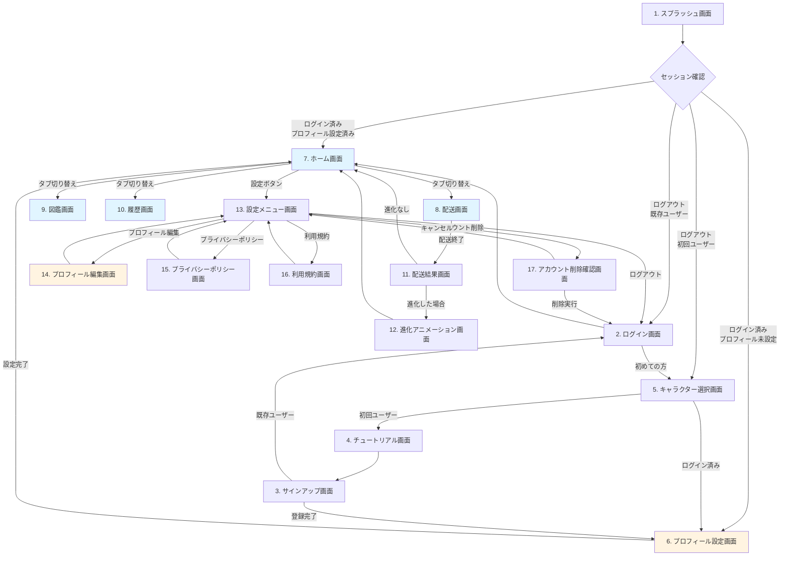

# デリモン サイトマップ

## 1. 画面構成概要

**総画面数**: 17画面 ⭐UPDATED

### 画面分類
- **認証フロー**: 6画面 ⭐UPDATED（プロフィール設定追加）
- **メインフロー（タブナビゲーション）**: 4画面
- **配送関連**: 2画面
- **設定関連**: 5画面 ⭐UPDATED（プロフィール編集追加）

---

## 2. 画面一覧

| No. | 画面名 | 分類 | 説明 |
|-----|--------|------|------|
| 1 | スプラッシュ画面 | 認証 | アプリ起動時の初期画面 |
| 2 | ログイン画面 | 認証 | 既存ユーザーのログイン |
| 3 | サインアップ画面 | 認証 | 新規ユーザー登録 |
| 4 | チュートリアル画面 | 認証 | 使い方説明（4枚スライド） |
| 5 | キャラクター選択画面 | 認証 | 初回の相棒選択 |
| **6** | **プロフィール設定画面** | **認証** | **初回登録時のプロフィール入力** ⭐NEW |
| 7 | ホーム画面 | メイン | 相棒キャラクター表示 |
| 8 | 配送画面 | メイン | GPS計測・地図表示 |
| 9 | 図鑑画面 | メイン | 所持キャラクター一覧 |
| 10 | 履歴画面 | メイン | 配送履歴・統計 |
| 11 | 配送結果画面 | 配送 | 配送終了時の結果表示 |
| 12 | 進化アニメーション画面 | 配送 | 進化演出 |
| 13 | 設定メニュー画面 | 設定 | 各種設定項目 |
| **14** | **プロフィール編集画面** | **設定** | **プロフィール情報の編集** ⭐NEW |
| 15 | プライバシーポリシー画面 | 設定 | プライバシーポリシー表示 |
| 16 | 利用規約画面 | 設定 | 利用規約表示 |
| 17 | アカウント削除確認画面 | 設定 | アカウント削除の確認 |

---

## 3. 画面フロー図



---

## 4. 画面詳細

### 4.1 スプラッシュ画面

**画面ID**: `splash`

**目的**: アプリ起動時のブランド表示、初期化処理

**表示内容**:
- アプリロゴ（デリモン）
- ローディングインジケーター

**処理**:
- セッション確認（Supabase Auth）
- 初期データ読み込み
- 画面遷移先の判定

**遷移先**:
- ログイン済み、キャラ選択済み → ホーム画面
- ログイン済み、キャラ未選択 → キャラクター選択画面
- ログアウト、既存ユーザー → ログイン画面
- ログアウト、初回ユーザー → キャラクター選択画面

**表示時間**: 1〜3秒

---

### 4.2 ログイン画面

**画面ID**: `login`

**目的**: 既存ユーザーのログイン

**表示内容**:
- メールアドレス入力フィールド
- パスワード入力フィールド
- ログインボタン
- 「初めての方はこちら」リンク

**バリデーション**:
- メールアドレス形式チェック
- パスワード入力必須

**操作**:
- ログインボタン: 認証実行
- 「初めての方はこちら」リンク: キャラクター選択画面へ

**遷移先**:
- ログイン成功 → ホーム画面
- 「初めての方はこちら」 → キャラクター選択画面

**エラー処理**:
- 認証エラー: 「メールアドレスまたはパスワードが間違っています」

---

### 4.3 サインアップ画面

**画面ID**: `signup`

**目的**: 新規ユーザー登録

**表示内容**:
- 選択したキャラクター表示（上部、小さく）
  - 「あなたの相棒: ハコブー」
  - キャラクター画像
- メールアドレス入力フィールド
- パスワード入力フィールド
- パスワード確認入力フィールド
- データ収集同意チェックボックス
  - 「位置情報データの収集に同意します」
  - プライバシーポリシーリンク
- サインアップボタン
- 「既にアカウントをお持ちの方」リンク

**バリデーション**:
- メールアドレス形式チェック
- パスワード要件チェック（8文字以上、英数字混在）
- パスワード確認一致チェック
- データ収集同意必須

**操作**:
- サインアップボタン: ユーザー登録実行 + キャラクター作成
- 「既にアカウントをお持ちの方」リンク: ログイン画面へ

**遷移先**:
- サインアップ成功 → ホーム画面
- 「既にアカウントをお持ちの方」 → ログイン画面

**エラー処理**:
- メールアドレス既存: 「このメールアドレスは既に使用されています」
- パスワード要件不足: 「パスワードは8文字以上、英数字を含む必要があります」

---

### 4.4 チュートリアル画面

**画面ID**: `tutorial`

**目的**: アプリの使い方を説明

**表示内容**: 4枚のスライド（スワイプで切り替え）

**スライド1**:
- 画像: 選択したキャラクター
- テキスト: 「①選んだ相棒を育てよう」

**スライド2**:
- 画像: 配送開始/終了ボタン
- テキスト: 「②配送開始ボタンで計測開始、配送終了ボタンで計測終了」

**スライド3**:
- 画像: 経験値バー、レベルアップ
- テキスト: 「③走行距離に応じて経験値ゲット、キャラが育つ」

**スライド4**:
- 画像: 進化したキャラクター
- テキスト: 「さあ、はじめよう！」
- ボタン: 「アカウント登録」（大きく、目立つ）

**操作**:
- 左右スワイプ: スライド切り替え
- インジケーター: 現在位置表示（●●○○）
- 「アカウント登録」ボタン: サインアップ画面へ

**遷移先**:
- 「アカウント登録」ボタン → サインアップ画面

---

### 4.5 キャラクター選択画面

**画面ID**: `character-select`

**目的**: ユーザーが初回に相棒キャラクターを選択

**表示内容**:
- タイトル: 「相棒を選ぼう！」
- キャラクター3体のカード
  - ハコブー
  - ルートン
  - シールン
- 各カード:
  - キャラクター画像（1段階目）
  - キャラクター名
  - 簡単な説明
  - 「選ぶ」ボタン

**操作**:
- いずれかの「選ぶ」ボタン: キャラクターを選択
  - 初回ユーザー: ローカルストレージに保存 → チュートリアル画面へ
  - ログイン済みユーザー: データベースに保存 → ホーム画面へ

**遷移先**:
- 初回ユーザー → チュートリアル画面
- ログイン済みユーザー → ホーム画面

**注意**: 一度選んだら変更不可（MVP）

---

### 4.6 プロフィール設定画面 ⭐NEW

**画面ID**: `profile-setup`

**目的**: 初回登録時のプロフィール情報入力

**表示内容**:
- **ヘッダー**:
  - タイトル: 「プロフィール設定」
  - サブタイトル: 「あなたについて教えてください」

- **入力フォーム**:
  1. **ニックネーム**
     - ラベル: 「ニックネーム」
     - 入力フィールド（テキスト）
     - 注意書き: 「2〜20文字、他のユーザーに公開されます」
  
  2. **生年月日**
     - ラベル: 「生年月日」
     - 3つの入力フィールド（数字）
       - 年（4桁）
       - 月（2桁）
       - 日（2桁）
     - 注意書き: 「誕生月イベントで使用します（非公開）」
  
  3. **性別**
     - ラベル: 「性別」
     - ラジオボタン: 男 / 女 / 答えたくない
     - 注意書き: 「統計情報として使用します（非公開）」
  
  4. **業種**
     - ラベル: 「業種」
     - ドロップダウン: トラックドライバー / 軽貨物ドライバー / フードデリバリー / 貨物船 / バス・タクシー / その他
     - 注意書き: 「統計情報として使用します（非公開）」

- **ボタン**:
  - 「完了」ボタン（下部、大きく）

**操作**:
- 各フィールドに入力
- リアルタイムバリデーション（入力中にエラー表示）
- 「完了」ボタン: バリデーションチェック → プロフィール保存 → ホーム画面へ

**遷移先**:
- 完了 → ホーム画面

**バリデーション**:
- ニックネーム: 2〜20文字、特殊文字禁止
- 生年月日: 妥当な日付
- 性別: 選択必須
- 業種: 選択必須

**API呼び出し**:
- `PUT /users/profile`: プロフィール情報を保存、識別番号を自動付与

---

### 4.7 ホーム画面

**画面ID**: `home` (タブ: `(tabs)/index`)

**目的**: 相棒キャラクターの状態表示

**表示内容**:
- **ヘッダー**:
  - 右上: 設定ボタン（歯車マーク、目立たない）
  
- **相棒キャラクター表示**:
  - キャラクター画像（大きく、現在の進化段階）
  - キャラクター名
  - レベル表示（例: Lv. 15）
  - 経験値バー（次のレベルまでの進捗）
  - 「次のレベルまであと5.2 km」

- **メッセージ**:
  - 「今日も安全運転で！」など、励ましメッセージ

**タブバー**:
- ホーム（選択中、文字色強調）
- 配送
- 図鑑
- 履歴

**操作**:
- 設定ボタンタップ: 設定メニュー画面へ
- キャラクタータップ: 反応なし（将来機能）
- タブ切り替え: 他の画面へ

**遷移先**:
- 設定ボタン → 設定メニュー画面
- 配送タブ → 配送画面
- 図鑑タブ → 図鑑画面
- 履歴タブ → 履歴画面

**データ更新**:
- Pull-to-refresh: キャラクター情報を再取得

---

### 4.7 配送画面

**画面ID**: `delivery` (タブ: `(tabs)/delivery`)

**目的**: GPS計測による移動距離の記録

**表示内容**:
- **地図**（全画面、または大部分）
  - 現在地マーカー
  - 配送中: スタート地点マーカー、移動ルート表示
  
- **上部オーバーレイ**（配送中のみ表示）:
  - 現在の走行距離（例: 15.5 km）
  - 経過時間（例: 01:23:45）
  
- **下部オーバーレイ**:
  - **配送前**: 「配送開始」ボタン（大きく、緑色）
  - **配送中**: 「配送終了」ボタン（大きく、赤色）

**タブバー**:
- 配送（選択中、文字色強調）

**操作**:
- 配送開始ボタンタップ:
  - GPS計測開始
  - バックグラウンドタスク開始
  - ボタンが「配送終了」に変化
  
- 配送終了ボタンタップ:
  - GPS計測終了
  - 距離計算
  - 経験値計算
  - データベース保存
  - 配送結果画面へ

**遷移先**:
- 配送終了 → 配送結果画面

**権限**:
- 位置情報の許可が必要

---

### 4.8 図鑑画面

**画面ID**: `collection` (タブ: `(tabs)/collection`)

**目的**: 所持しているキャラクターの表示

**表示内容**:
- **キャラクター一覧**（3体 × 3段階 = 9枠）
  - グリッド表示（3列 × 3行）
  
- **各枠の表示**:
  - **所持している**: 
    - キャラクター画像（フルカラー）
    - キャラクター名（例: ハコブー、ハコブオン）
    - 進化段階表記（例: 第1段階）
  - **未所持**: 
    - 「？」マーク
    - シルエット
  
- **現在の相棒**: 
  - 目印（例: 星マーク、または枠の色が違う）

**キャラクター名（進化段階）**:
- ハコブー（1段階）
- ハコブオン（2段階）
- ハコブオーン（3段階）※後日確定
- ルートン系（後日確定）
- シールン系（後日確定）

**表示例**:
```
初期状態（レベル1、ハコブー選択）:
[ハコブー★] [?] [?]
[?] [?] [?]
[?] [?] [?]

レベル25（2段階進化後）:
[ハコブー] [ハコブオン★] [?]
[?] [?] [?]
[?] [?] [?]

レベル55（3段階進化後）:
[ハコブー] [ハコブオン] [ハコブオーン★]
[?] [?] [?]
[?] [?] [?]
```

**タブバー**:
- 図鑑（選択中、文字色強調）

**操作**:
- キャラクタータップ: 反応なし（将来機能で詳細表示）

**データ更新**:
- Pull-to-refresh: キャラクター情報を再取得

---

### 4.9 履歴画面

**画面ID**: `history` (タブ: `(tabs)/history`)

**目的**: 配送履歴と統計情報の表示

**表示内容**:
- **期間切り替えタブ**:
  - 日別 / 週別 / 月別（3つのタブ）
  
- **棒グラフ表示**:
  - 横軸: 日付（例: 1/1, 1/2, ...）
  - 縦軸: 走行距離（km）
  - 選択期間に応じてデータ表示
  
- **統計情報**:
  - 選択期間の累計走行距離（例: 今月: 250.5 km）
  - 1日あたりの平均走行距離（例: 平均: 12.5 km/日）
  - 全期間の累計走行距離（例: 累計: 1,500.0 km）

- **配送履歴リスト**（スクロール可能）:
  - 各配送の日時、距離、所要時間
  - 表示例: 「2025/01/15 10:00 - 25.5km (1時間30分)」
  - 最新50件を表示

**タブバー**:
- 履歴（選択中、文字色強調）

**操作**:
- 期間タブ切り替え: グラフとデータを更新
- Pull-to-refresh: データ再取得
- 配送履歴タップ: 反応なし（将来機能でルート表示など）

**データ更新**:
- 初回表示時、期間切り替え時にデータ取得

---

### 4.10 配送結果画面

**画面ID**: `delivery-result`

**目的**: 配送終了時の結果表示

**表示内容**:
- **タイトル**: 「お疲れ様でした！」
- **キャラクター画像**（小さく表示）
- **配送結果**:
  - 走行距離: 25.5 km
  - 所要時間: 1時間30分
  - 獲得経験値: 2,550 経験値
- **レベル変化**:
  - 進化なし: 「Lv. 15 → Lv. 17」
  - 進化あり: 「Lv. 19 → Lv. 20 進化！」（強調表示）
- **ボタン**: 「閉じる」（大きく、中央）

**操作**:
- 閉じるボタン:
  - 進化した場合 → 進化アニメーション画面
  - 進化していない場合 → ホーム画面

**遷移先**:
- 進化あり → 進化アニメーション画面 → ホーム画面
- 進化なし → ホーム画面

**表示タイミング**: 配送終了直後

---

### 4.11 進化アニメーション画面

**画面ID**: `evolution`

**目的**: キャラクター進化の演出

**表示内容**:
- **フルスクリーン表示**
- **アニメーション**:
  1. 進化前のキャラクター表示
  2. 光エフェクトで包まれる（静止画切り替え）
  3. 光が解ける
  4. 進化後のキャラクター表示
- **テキスト**:
  - アニメーション中: 「進化しています...」
  - アニメーション後: 「ハコブーがハコブオンに進化した！」
- **ボタン**: 「おめでとう！」（アニメーション後に表示）

**所要時間**: 3〜5秒

**操作**:
- おめでとうボタン: ホーム画面へ
- スキップ不可

**遷移先**:
- おめでとうボタン → ホーム画面

**実装方法**: 静止画の切り替え（アニメーション画像3〜5枚）

**プッシュ通知**: この画面表示時に進化通知も送信

---

### 4.12 設定メニュー画面

**画面ID**: `settings/index`

**目的**: 各種設定項目へのアクセス

**表示内容**:
- **ヘッダー**: 「設定」、戻るボタン（左上）
- **メニューリスト**:
  1. **プロフィール編集** ⭐NEW
     - 右側: 矢印アイコン
     - 説明: 「ニックネーム、生年月日などを編集」
  
  2. **データ収集の設定**
     - 右側: スイッチ（ON/OFF）
     - 説明: 「位置情報データの収集」
  
  3. **通知設定**
     - 右側: スイッチ（ON/OFF）
     - 説明: 「プッシュ通知の受信」
  
  4. **お問い合わせ**
     - 右側: 矢印アイコン
  
  5. **プライバシーポリシー**
     - 右側: 矢印アイコン
  
  6. **利用規約**
     - 右側: 矢印アイコン
  
  7. **アカウント削除**
     - 右側: 矢印アイコン
     - 文字色: 赤色（警告）
  
  8. **ログアウト**
     - 右側: 矢印アイコン
  
  9. **アプリバージョン**
     - 右側: バージョン番号（例: v1.0.0）
     - タップ不可

**操作**:
- プロフィール編集: プロフィール編集画面へ ⭐NEW
- データ収集の設定: その場でON/OFF切り替え（即座に保存）
- 通知設定: その場でON/OFF切り替え（即座に保存）
- お問い合わせ: ブラウザでGoogleフォーム開く
- プライバシーポリシー: プライバシーポリシー画面へ
- 利用規約: 利用規約画面へ
- アカウント削除: アカウント削除確認画面へ
- ログアウト: 確認ダイアログ表示 → 実行 → ログイン画面へ
- 戻るボタン: ホーム画面へ

**遷移先**:
- プロフィール編集 → プロフィール編集画面 ⭐NEW
- プライバシーポリシー → プライバシーポリシー画面
- 利用規約 → 利用規約画面
- アカウント削除 → アカウント削除確認画面
- ログアウト → ログイン画面
- 戻るボタン → ホーム画面

**確認ダイアログ（ログアウト時）**:
- タイトル: 「ログアウトしますか？」
- ボタン: 「ログアウト」「キャンセル」

---

### 4.14 プロフィール編集画面 ⭐NEW

**画面ID**: `settings/profile-edit`

**目的**: プロフィール情報の編集

**表示内容**:
- **ヘッダー**: 「プロフィール編集」、戻るボタン（左上）

- **入力フォーム**（プロフィール設定画面と同じ構成）:
  1. **ニックネーム**
     - 現在の値が表示された入力フィールド
     - 識別番号は表示のみ（例: #1234）、編集不可
  
  2. **生年月日**
     - 現在の値が表示された3つの入力フィールド
  
  3. **性別**
     - 現在の選択が反映されたラジオボタン
  
  4. **業種**
     - 現在の選択が反映されたドロップダウン

- **ボタン**:
  - 「保存」ボタン（下部、大きく、青色）
  - 「キャンセル」ボタン（グレー）

**操作**:
- 各フィールドを編集
- 「保存」ボタン: バリデーションチェック → 保存 → 成功メッセージ → 設定メニュー画面へ
- 「キャンセル」ボタン: 変更確認ダイアログ → 設定メニュー画面へ
- 戻るボタン: 変更確認ダイアログ → 設定メニュー画面へ

**遷移先**:
- 保存成功 → 設定メニュー画面
- キャンセル → 設定メニュー画面

**変更検知**:
- 入力内容に変更がある場合のみ保存ボタン有効化
- 変更なしで戻る: 確認ダイアログなし
- 変更ありで戻る: 「変更を破棄しますか？」確認ダイアログ

**API呼び出し**:
- `GET /users/profile`: 現在のプロフィール情報を取得
- `PUT /users/profile`: プロフィール情報を更新（識別番号は変更なし）

---

### 4.15 プライバシーポリシー画面

**画面ID**: `settings/privacy`

**目的**: プライバシーポリシーの表示

**表示内容**:
- **ヘッダー**: 「プライバシーポリシー」、戻るボタン
- **本文**: スクロール可能なテキスト
  - 収集するデータ（メールアドレス、位置情報、走行距離）
  - 利用目的
  - 第三者提供の有無（将来のB2Bデータ提供について明記）
  - オプトアウトの方法
  - データ削除の方法（アカウント削除）
  - 問い合わせ先

**操作**:
- 戻るボタン: 設定メニュー画面へ
- スクロール: 本文を読む

**遷移先**:
- 戻るボタン → 設定メニュー画面

**作成方法**: 無料テンプレートを使用

---

### 4.16 利用規約画面

**画面ID**: `settings/terms`

**目的**: 利用規約の表示

**表示内容**:
- **ヘッダー**: 「利用規約」、戻るボタン
- **本文**: スクロール可能なテキスト
  - 利用条件
  - 禁止事項
  - 免責事項
  - 規約の変更
  - 準拠法

**操作**:
- 戻るボタン: 設定メニュー画面へ
- スクロール: 本文を読む

**遷移先**:
- 戻るボタン → 設定メニュー画面

**作成方法**: 無料テンプレートを使用

---

### 4.17 アカウント削除確認画面

**画面ID**: `settings/delete-account`

**目的**: アカウント削除の最終確認

**表示内容**:
- **タイトル**: 「アカウント削除」
- **警告文**:
  - 「アカウントを削除すると、以下のデータがすべて削除されます：」
  - ・キャラクター情報
  - ・配送履歴
  - ・走行記録
  - 「この操作は取り消せません。」
- **確認チェックボックス**: 「上記の内容を理解しました」
- **ボタン**:
  - 「削除する」（赤色、チェックONで有効化）
  - 「キャンセル」

**操作**:
- 確認チェックボックス: ON/OFF切り替え
- 削除するボタン:
  - チェックOFF時: 無効（グレーアウト）
  - チェックON時: 有効
  - タップ: 最終確認ダイアログ表示
- キャンセルボタン: 設定メニュー画面へ

**最終確認ダイアログ**:
- タイトル: 「本当に削除しますか？」
- メッセージ: 「この操作は取り消せません」
- ボタン: 「削除する」「キャンセル」

**削除実行**:
1. Supabaseでユーザー削除（CASCADE DELETEで関連データも削除）
2. ローカルストレージクリア
3. ログイン画面へ遷移

**遷移先**:
- 削除実行 → ログイン画面
- キャンセル → 設定メニュー画面

---

## 5. タブナビゲーション

### タブ構成
| タブ | アイコン | 画面 | 説明 |
|------|---------|------|------|
| ホーム | 家アイコン | ホーム画面 | 相棒キャラクター |
| 配送 | トラックアイコン | 配送画面 | GPS計測 |
| 図鑑 | 本アイコン | 図鑑画面 | キャラクター一覧 |
| 履歴 | グラフアイコン | 履歴画面 | 統計・履歴 |

### タブの表示
- **選択中**: 文字色が強調（例: 青色）、アイコンも強調色
- **未選択**: 文字色がグレー、アイコンもグレー

### タブバーの位置
- 下部固定

---

## 6. 画面遷移パターン

### 認証フロー
```
初回ユーザー:
スプラッシュ → キャラ選択 → チュートリアル → サインアップ → ホーム

既存ユーザー（ログイン済み）:
スプラッシュ → ホーム

既存ユーザー（ログアウト）:
スプラッシュ → ログイン → ホーム
```

### メインフロー
```
ホーム ⇄ 配送 ⇄ 図鑑 ⇄ 履歴（タブ切り替え）
```

### 配送フロー
```
配送画面 → 配送結果画面 → [進化アニメーション画面] → ホーム画面
```

### 設定フロー
```
ホーム → 設定メニュー → プライバシーポリシー/利用規約/アカウント削除 → 設定メニュー → ホーム
```

---

## 7. 画面実装の優先順位

### Phase 1: 認証フロー（1週間）
1. スプラッシュ画面
2. ログイン画面
3. サインアップ画面
4. キャラクター選択画面
5. チュートリアル画面

### Phase 2: メインフロー（2週間）
6. ホーム画面
7. 配送画面
10. 配送結果画面

### Phase 3: 追加機能（1週間）
8. 図鑑画面
9. 履歴画面
11. 進化アニメーション画面

### Phase 4: 設定（3日）
12. 設定メニュー画面
13. プライバシーポリシー画面
14. 利用規約画面
15. アカウント削除確認画面

---

## 8. 画面デザインの共通要素

### カラーパレット
- **プライマリカラー**: 青系（UIイメージから）
- **セカンダリカラー**: 緑系（配送開始ボタン）
- **警告色**: 赤系（配送終了、アカウント削除）
- **背景色**: 白/淡いグレー
- **テキスト色**: ダークグレー/ブラック

### タイポグラフィ
- **ヘッダー**: 大きめ、太字
- **本文**: 読みやすいサイズ
- **キャプション**: 小さめ

### ボタンスタイル
- **プライマリボタン**: 大きく、目立つ色（青/緑）
- **セカンダリボタン**: 控えめな色（グレー）
- **危険なアクション**: 赤色（削除、配送終了）

### スペーシング
- 一貫したマージン・パディング
- React Native Paperのデフォルトスペーシングを活用

---

## 9. レスポンシブ対応

### 画面サイズ
- **スマートフォン**: 主要ターゲット（縦向き）
- **タブレット**: 将来対応を検討

### 横向き対応
- **MVP**: 縦向きのみ対応
- **将来**: 横向きも対応（特に配送画面の地図表示）

---

## 10. アクセシビリティ

### 基本対応
- ボタンのタップ領域を十分に確保（最小44×44pt）
- コントラスト比を確保
- 重要な情報は色だけで表現しない

### スクリーンリーダー対応
- 将来的に対応を検討

---

## 11. パフォーマンス

### 画面遷移
- 目標: 500ms以内
- アニメーション: スムーズに

### 画像最適化
- キャラクター画像: 適切なサイズに圧縮
- 遅延読み込み: 必要に応じて実装

---

## 12. 今後の拡張

### 追加予定の画面（将来機能）
- キャラクター詳細画面（図鑑からタップ）
- 配送ルート詳細画面（履歴からタップ）
- フレンド一覧画面
- ランキング画面
- すれ違い通信設定画面
- プライバシーエリア設定画面（地図上で設定）
- 日報作成画面
- ガチャ画面
- 実績・バッジ一覧画面

---

以上
