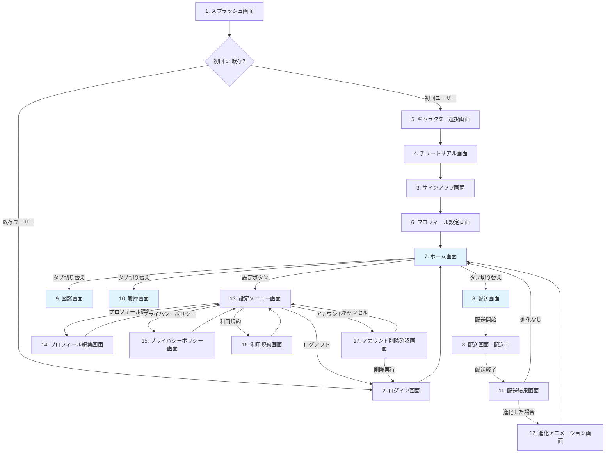

# デリモン - 画面遷移図（プロフィール設定追加版）

---

## 1. 概要

本ドキュメントは、デリモン（Delivery Monsters）アプリの画面遷移を定義します。

**最終更新日**: 2025年11月6日  
**バージョン**: 1.1（プロフィール設定追加）

---

## 2. 変更履歴

| 日付 | バージョン | 変更内容 |
|------|-----------|---------|
| 2025-11-06 | 1.1 | プロフィール設定画面を追加、フローを修正 |
| 2025-11-06 | 1.0 | 初版作成 |

---

## 3. アプリフロー図（全体像）

### 3.1 初回ユーザーフロー



---

## 4. 画面一覧

| # | 画面名 | 画面ID | 種別 | 認証 |
|---|--------|--------|------|------|
| 1 | スプラッシュ画面 | `splash` | 全画面 | 不要 |
| 2 | ログイン画面 | `login` | 全画面 | 不要 |
| 3 | サインアップ画面 | `signup` | 全画面 | 不要 |
| 4 | チュートリアル画面 | `tutorial` | 全画面 | 不要 |
| 5 | キャラクター選択画面 | `character-select` | 全画面 | 不要 |
| 6 | プロフィール設定画面 | `profile-setup` | 全画面 | 必要 |
| 7 | ホーム画面 | `(tabs)/index` | タブ | 必要 |
| 8 | 配送画面 | `(tabs)/delivery` | タブ | 必要 |
| 9 | 図鑑画面 | `(tabs)/pokedex` | タブ | 必要 |
| 10 | 履歴画面 | `(tabs)/history` | タブ | 必要 |
| 11 | 配送結果画面 | `delivery-result` | モーダル | 必要 |
| 12 | 進化アニメーション画面 | `evolution` | 全画面モーダル | 必要 |
| 13 | 設定メニュー画面 | `settings` | 全画面 | 必要 |
| 14 | プロフィール編集画面 | `profile-edit` | 全画面 | 必要 |
| 15 | プライバシーポリシー画面 | `privacy-policy` | 全画面 | 必要 |
| 16 | 利用規約画面 | `terms-of-service` | 全画面 | 必要 |
| 17 | アカウント削除確認画面 | `delete-account-confirm` | 全画面 | 必要 |

**合計**: 17画面

---

## 5. 画面詳細

### 5.1 スプラッシュ画面

**画面ID**: `splash`

**目的**: アプリ起動時のブランド表示、初期化処理

**表示内容**:
- アプリロゴ（デリモン）
- ローディングインジケーター

**処理**:
- セッション確認（Supabase Auth）
- 初期データ読み込み
- 画面遷移先の判定

**遷移先**:
- ログイン済み、プロフィール設定済み → ホーム画面
- ログイン済み、プロフィール未設定 → プロフィール設定画面
- ログアウト、既存ユーザー → ログイン画面
- ログアウト、初回ユーザー → キャラクター選択画面

**表示時間**: 1〜3秒

---

### 5.2 ログイン画面

**画面ID**: `login`

**目的**: 既存ユーザーのログイン

**表示内容**:
- メールアドレス入力フィールド
- パスワード入力フィールド
- ログインボタン
- 「初めての方はこちら」リンク

**バリデーション**:
- メールアドレス形式チェック
- パスワード入力必須

**操作**:
- ログインボタン: 認証実行
- 「初めての方はこちら」リンク: キャラクター選択画面へ

**遷移先**:
- ログイン成功 → ホーム画面
- 「初めての方はこちら」 → キャラクター選択画面

**エラー処理**:
- 認証エラー: 「メールアドレスまたはパスワードが間違っています」

---

### 5.3 サインアップ画面

**画面ID**: `signup`

**目的**: 新規ユーザー登録

**表示内容**:
- 選択したキャラクター表示（上部、小さく）
  - 「あなたの相棒: ハコブー」
  - キャラクター画像
- メールアドレス入力フィールド
- パスワード入力フィールド
- パスワード確認入力フィールド
- データ収集同意チェックボックス
  - 「位置情報データの収集に同意します」
  - プライバシーポリシーリンク
- サインアップボタン
- 「既にアカウントをお持ちの方」リンク

**バリデーション**:
- メールアドレス形式チェック
- パスワード要件チェック（8文字以上、英数字混在）
- パスワード確認一致チェック
- データ収集同意必須

**操作**:
- サインアップボタン: ユーザー登録実行 + キャラクター作成
- 「既にアカウントをお持ちの方」リンク: ログイン画面へ

**遷移先**:
- サインアップ成功 → **プロフィール設定画面**
- 「既にアカウントをお持ちの方」 → ログイン画面

**エラー処理**:
- メールアドレス既存: 「このメールアドレスは既に使用されています」
- パスワード要件不足: 「パスワードは8文字以上、英数字を含む必要があります」

---

### 5.4 チュートリアル画面

**画面ID**: `tutorial`

**目的**: アプリの使い方を説明

**表示内容**: 4枚のスライド（スワイプで切り替え）

**スライド1**:
- 画像: 選択したキャラクター
- テキスト: 「①選んだ相棒を育てよう」

**スライド2**:
- 画像: 配送開始/終了ボタン
- テキスト: 「②配送開始ボタンで計測開始、配送終了ボタンで計測終了」

**スライド3**:
- 画像: 経験値バー、レベルアップ
- テキスト: 「③走行距離に応じて経験値ゲット、キャラが育つ」

**スライド4**:
- 画像: 進化したキャラクター
- テキスト: 「さあ、はじめよう！」
- ボタン: 「アカウント登録」（大きく、目立つ）

**操作**:
- 左右スワイプ: スライド切り替え
- インジケーター: 現在位置表示（●●○○）
- 「アカウント登録」ボタン: サインアップ画面へ

**遷移先**:
- 「アカウント登録」ボタン → サインアップ画面

---

### 5.5 キャラクター選択画面

**画面ID**: `character-select`

**目的**: ユーザーが初回に相棒キャラクターを選択

**表示内容**:
- タイトル: 「相棒を選ぼう！」
- キャラクター3体のカード
  - ハコブー
  - ルートン
  - シールン
- 各カード:
  - キャラクター画像（1段階目）
  - キャラクター名
  - 簡単な説明
  - 「選ぶ」ボタン

**操作**:
- いずれかの「選ぶ」ボタン: キャラクターを選択
  - 初回ユーザー: ローカルストレージに保存 → チュートリアル画面へ
  - ログイン済みユーザー: データベースに保存 → プロフィール設定画面へ

**遷移先**:
- 初回ユーザー → チュートリアル画面
- ログイン済みユーザー → プロフィール設定画面

**注意**: 一度選んだら変更不可（MVP）

---

### 5.6 プロフィール設定画面 ⭐NEW

**画面ID**: `profile-setup`

**目的**: 初回登録時のプロフィール情報入力

**表示内容**:

- **ヘッダー**:
  - タイトル: 「プロフィール設定」
  - サブタイトル: 「あなたについて教えてください」

- **入力フォーム**:
  
  1. **ニックネーム**
     - ラベル: 「ニックネーム」
     - 入力フィールド（テキスト）
     - 注意書き: 「2〜20文字、他のユーザーに公開されます」
     - バリデーション表示エリア
  
  2. **生年月日**
     - ラベル: 「生年月日」
     - 3つの入力フィールド（数字）
       - 年（4桁）: プレースホルダー「1990」
       - 月（2桁）: プレースホルダー「06」
       - 日（2桁）: プレースホルダー「25」
     - 注意書き: 「誕生月イベントで使用します（非公開）」
  
  3. **性別**
     - ラベル: 「性別」
     - ラジオボタン:
       - 男
       - 女
       - 答えたくない
     - 注意書き: 「統計情報として使用します（非公開）」
  
  4. **業種**
     - ラベル: 「業種」
     - ドロップダウン:
       - トラックドライバー
       - 軽貨物ドライバー
       - フードデリバリー
       - 貨物船
       - バス・タクシー
       - その他
     - 注意書き: 「統計情報として使用します（非公開）」

- **ボタン**:
  - 「完了」ボタン（下部、大きく）

**バリデーション**:
- ニックネーム:
  - 必須入力
  - 2〜20文字
  - 特殊文字禁止（日本語、英数字、アンダーバー、ハイフンのみ）
  - リアルタイムでエラー表示
- 生年月日:
  - 必須入力
  - 年: 1900〜2025
  - 月: 1〜12
  - 日: 1〜31（月に応じて変動）
  - 妥当な日付チェック
- 性別: 必須選択
- 業種: 必須選択

**操作**:
- 「完了」ボタン:
  - バリデーションチェック
  - プロフィール情報をデータベースに保存
  - ニックネームに4桁の識別番号を自動付与（例: 太郎#1234）
  - ホーム画面へ

**遷移先**:
- 完了 → ホーム画面

**エラー処理**:
- バリデーションエラー: 該当フィールドの下にエラーメッセージ表示
- 保存失敗: 「保存に失敗しました。もう一度お試しください」ダイアログ

**技術実装メモ**:
- ニックネームの識別番号は4桁のランダム数字（0001〜9999）
- データベースには以下を保存:
  - `nickname`: 表示用ニックネーム（識別番号なし）
  - `display_id`: 4桁の識別番号
  - `birth_date`: DATE型
  - `gender`: ENUM型
  - `occupation`: ENUM型

---

### 5.7 ホーム画面

**画面ID**: `home` (タブ: `(tabs)/index`)

**目的**: 相棒キャラクターの状態表示

**表示内容**:

- **ヘッダー**:
  - 右上: 設定ボタン（歯車マーク、目立たない）
  
- **相棒キャラクター表示**:
  - キャラクター画像（大きく、現在の進化段階）
  - キャラクター名
  - レベル表示（例: Lv. 5）
  - 経験値バー
    - 現在の経験値 / 次のレベルまでの経験値
    - 例: 「450 / 1000 EXP」
  - 進化可能な場合: 「進化できます！」バッジ表示

- **統計情報**:
  - 今日の走行距離
  - 今週の走行距離
  - 総走行距離

- **ボトムタブナビゲーション**:
  - ホーム（現在地）
  - 配送
  - 図鑑
  - 履歴

**操作**:
- 設定ボタン: 設定メニュー画面へ
- タブ切り替え: 各画面へ
- キャラクター画像タップ: キャラクター詳細（将来機能）

**遷移先**:
- 設定ボタン → 設定メニュー画面
- 配送タブ → 配送画面
- 図鑑タブ → 図鑑画面
- 履歴タブ → 履歴画面

**データ読み込み**:
- ユーザーのキャラクター情報
- プロフィール情報（ニックネーム表示用）
- 配送履歴から統計計算

---

### 5.8 配送画面

**画面ID**: `delivery` (タブ: `(tabs)/delivery`)

**目的**: 配送の開始・終了、リアルタイム計測

**表示内容**:

**配送前の状態**:
- 地図表示（現在地中心）
- 「配送を開始」ボタン（大きく、中央下部）
- 今日の配送回数表示
  - 例: 「今日の配送: 3回」

**配送中の状態**:
- 地図表示
  - 現在地マーカー
  - 移動軌跡（青いライン）
  - スタート地点マーカー（緑）
- リアルタイム情報表示（上部カード）:
  - 走行距離: 「12.5 km」
  - 走行時間: 「1時間23分」
  - 獲得予定経験値: 「+125 EXP」
- 「配送を終了」ボタン（大きく、赤色、中央下部）

**操作**:
- 「配送を開始」ボタン:
  - GPS権限チェック
  - 位置情報トラッキング開始
  - 配送中状態に切り替え
- 「配送を終了」ボタン:
  - 確認ダイアログ表示
  - 位置情報トラッキング停止
  - 配送結果画面へ

**遷移先**:
- 配送開始 → 配送中状態（画面内状態変更）
- 配送終了 → 配送結果画面

**エラー処理**:
- GPS権限なし: 「位置情報へのアクセスを許可してください」ダイアログ → 設定画面へ誘導
- GPS信号弱い: 「GPS信号が弱いです」警告表示

**バックグラウンド動作**:
- アプリを閉じても位置情報トラッキング継続
- 通知表示: 「配送中: 12.5km」

---

### 5.9 図鑑画面

**画面ID**: `pokedex` (タブ: `(tabs)/pokedex`)

**目的**: 全キャラクターの確認、収集状況の表示

**表示内容**:

- **ヘッダー**:
  - タイトル: 「図鑑」
  - 収集率表示: 「1 / 9体」（MVPでは相棒のみ）

- **キャラクター一覧**（グリッド表示、3列）:
  - 相棒キャラクター:
    - キャラクター画像（現在の進化段階）
    - キャラクター名
    - 図鑑番号（例: No.001）
    - レベル表示
    - 「相棒」バッジ
  - その他のキャラクター:
    - シルエット表示
    - 「???」
    - 「未取得」

**操作**:
- 相棒キャラクターカードタップ: キャラクター詳細表示（モーダル）
  - キャラクター画像
  - 名前、レベル
  - 現在の経験値
  - 進化系統図
  - 図鑑説明文
  - 閉じるボタン

**データ読み込み**:
- 全キャラクターマスタデータ
- ユーザーの相棒キャラクター

---

### 5.10 履歴画面

**画面ID**: `history` (タブ: `(tabs)/history`)

**目的**: 過去の配送履歴の確認

**表示内容**:

- **ヘッダー**:
  - タイトル: 「履歴」
  - 期間選択: 「今週」「今月」「全期間」

- **統計カード**（上部）:
  - 選択期間の合計走行距離
  - 選択期間の配送回数
  - 選択期間の獲得経験値

- **配送履歴リスト**（下部、スクロール可能）:
  - 各配送記録カード:
    - 日付・時刻: 「2025年11月6日 14:30」
    - 走行距離: 「12.5 km」
    - 走行時間: 「1時間23分」
    - 獲得経験値: 「+125 EXP」
    - 進化アイコン（進化があった場合）

**操作**:
- 期間選択タブタップ: 表示期間変更、データ再読み込み
- 配送記録カードタップ: 配送詳細表示（モーダル）
  - 地図（ルート表示）
  - 詳細情報

**データ読み込み**:
- ユーザーの配送履歴データ
- 期間でフィルタリング

**Pull-to-refresh**: 下に引っ張って更新

---

### 5.11 配送結果画面

**画面ID**: `delivery-result` (モーダル)

**目的**: 配送終了後の結果表示

**表示内容**:

- **背景**: 半透明オーバーレイ

- **結果カード**（中央）:
  - タイトル: 「配送完了！」
  - アイコン: チェックマーク、または相棒キャラクター
  
  - **配送情報**:
    - 走行距離: 「12.5 km」
    - 走行時間: 「1時間23分」
    - 平均速度: 「9 km/h」
  
  - **報酬情報**:
    - 獲得経験値: 「+125 EXP」
    - 経験値バー（レベルアップのアニメーション）
    - レベルアップした場合: 「レベルアップ！ Lv.5 → Lv.6」
  
  - **進化判定**:
    - 進化条件を満たした場合: 「進化できます！」バッジ
    - 「進化を見る」ボタン
  
  - **閉じるボタン**: 「ホームへ戻る」

**操作**:
- 「進化を見る」ボタン: 進化アニメーション画面へ
- 「ホームへ戻る」ボタン: ホーム画面へ
- 背景タップ: 無効
- 戻るボタン: 無効

**遷移先**:
- 進化する場合 → 進化アニメーション画面
- 進化しない場合 → ホーム画面

**アニメーション**:
- モーダルが下から上にスライドイン
- 経験値バーが滑らかに増加
- レベルアップ時: 光のエフェクト

---

### 5.12 進化アニメーション画面

**画面ID**: `evolution` (全画面モーダル)

**目的**: キャラクターの進化演出

**表示内容**:

**Phase 1: 進化前（1秒）**:
- 背景: 白い光
- 進化前のキャラクター画像（中央）
- 「進化している...」テキスト

**Phase 2: 進化中（2秒）**:
- キャラクター画像がシルエットに変化
- 光のエフェクト（キラキラ、光の粒子）
- シルエットが大きくなる

**Phase 3: 進化後（3秒）**:
- 光が弾ける
- 進化後のキャラクター画像が表示
- 「おめでとう！」テキスト
- キャラクター名表示: 「ハコブーがハコドンに進化した！」
- 「OK」ボタン（下部）

**操作**:
- Phase 1〜2: タップ不可
- Phase 3の「OK」ボタン: ホーム画面へ
- 戻るボタン: 無効

**遷移先**:
- 「OK」ボタン → ホーム画面

**アニメーション詳細**:
- BGM再生（将来機能）
- バイブレーション
- 画面全体の明滅エフェクト

**スキップ不可**: ユーザーに進化の喜びを味わってもらう

---

### 5.13 設定メニュー画面

**画面ID**: `settings`

**目的**: アプリ設定とアカウント管理

**表示内容**:

- **ヘッダー**:
  - タイトル: 「設定」
  - 戻るボタン（左上）

- **メニュー一覧**（リスト形式）:

  **アカウント**:
  - ユーザー情報表示
    - ニックネーム（識別番号付き、例: 太郎#1234）
    - メールアドレス
    - 登録日
  - **「プロフィール編集」** ⭐NEW
  - 「アカウントを削除」（赤文字、最下部）

  **アプリ設定**:
  - 通知設定
    - 配送リマインダー（ON/OFF）
    - レベルアップ通知（ON/OFF）
  - 音声設定
    - 効果音（ON/OFF）
    - BGM（ON/OFF、将来機能）
  - 地図設定
    - 地図タイプ（標準/衛星/地形）

  **データ・プライバシー**:
  - 「プライバシーポリシー」
  - 「利用規約」
  - データ収集設定
    - 位置情報の収集（ON/OFF）
    - 使用統計の送信（ON/OFF）

  **その他**:
  - バージョン情報
  - お問い合わせ（将来機能）
  - 「ログアウト」

**操作**:
- 戻るボタン: ホーム画面へ
- 各メニュー項目タップ: 対応する画面または設定変更
- **「プロフィール編集」: プロフィール編集画面へ** ⭐NEW
- 「プライバシーポリシー」: プライバシーポリシー画面へ
- 「利用規約」: 利用規約画面へ
- 「アカウントを削除」: アカウント削除確認画面へ
- 「ログアウト」: 確認ダイアログ → ログイン画面へ

**遷移先**:
- 戻るボタン → ホーム画面
- プロフィール編集 → プロフィール編集画面 ⭐NEW
- プライバシーポリシー → プライバシーポリシー画面
- 利用規約 → 利用規約画面
- アカウント削除 → アカウント削除確認画面
- ログアウト → ログイン画面

**トグルスイッチ**:
- 即座に設定変更を保存
- 位置情報の収集をOFFにした場合: 警告ダイアログ表示

---

### 5.14 プロフィール編集画面 ⭐NEW

**画面ID**: `profile-edit`

**目的**: プロフィール情報の編集

**表示内容**:

- **ヘッダー**:
  - タイトル: 「プロフィール編集」
  - 戻るボタン（左上）

- **入力フォーム** (5.6と同じ構成):
  
  1. **ニックネーム**
     - 現在の値が表示された入力フィールド
     - 識別番号は編集不可（表示のみ、例: #1234）
     - 注意書き: 「2〜20文字、他のユーザーに公開されます」
  
  2. **生年月日**
     - 現在の値が表示された3つの入力フィールド
     - 注意書き: 「誕生月イベントで使用します（非公開）」
  
  3. **性別**
     - 現在の選択が反映されたラジオボタン
     - 注意書き: 「統計情報として使用します（非公開）」
  
  4. **業種**
     - 現在の選択が反映されたドロップダウン
     - 注意書き: 「統計情報として使用します（非公開）」

- **ボタン**:
  - 「保存」ボタン（下部、大きく、青色）
  - 「キャンセル」ボタン（グレー）

**バリデーション**:
- プロフィール設定画面と同じ

**操作**:
- 戻るボタン: 変更確認ダイアログ → 設定メニュー画面へ
- 「保存」ボタン:
  - バリデーションチェック
  - プロフィール情報を更新
  - 成功メッセージ表示
  - 設定メニュー画面へ
- 「キャンセル」ボタン:
  - 変更確認ダイアログ → 設定メニュー画面へ

**遷移先**:
- 保存成功 → 設定メニュー画面
- キャンセル → 設定メニュー画面
- 戻るボタン → 設定メニュー画面

**変更確認ダイアログ**:
- 変更がある場合のみ表示
- 「変更を破棄しますか？」
- 「破棄」「キャンセル」ボタン

**エラー処理**:
- バリデーションエラー: 該当フィールドの下にエラーメッセージ
- 保存失敗: 「保存に失敗しました。もう一度お試しください」ダイアログ

---

### 5.15 プライバシーポリシー画面

**画面ID**: `privacy-policy`

**目的**: プライバシーポリシーの表示

**表示内容**:

- **ヘッダー**:
  - タイトル: 「プライバシーポリシー」
  - 戻るボタン（左上）

- **コンテンツ**（スクロール可能）:
  - プライバシーポリシーの全文
  - セクション:
    1. 収集する情報
       - 位置情報データ
       - アカウント情報（メールアドレス）
       - プロフィール情報（ニックネーム、生年月日、性別、業種） ⭐NEW
       - 使用統計
    2. 情報の利用目的
       - サービス提供
       - 機能改善
       - データ分析
       - 誕生月イベント ⭐NEW
    3. 情報の公開範囲 ⭐NEW
       - 公開: ニックネーム（識別番号付き）
       - 非公開: 生年月日、性別、業種
    4. 情報の共有
       - 第三者への提供なし
    5. データの保存期間
    6. ユーザーの権利
       - データ削除の権利
       - オプトアウトの権利
       - プロフィール編集の権利 ⭐NEW
    7. お問い合わせ先

**操作**:
- 戻るボタン: 設定メニュー画面へ
- スクロール: コンテンツ閲覧

**遷移先**:
- 戻るボタン → 設定メニュー画面

---

### 5.16 利用規約画面

**画面ID**: `terms-of-service`

**目的**: 利用規約の表示

**表示内容**:

- **ヘッダー**:
  - タイトル: 「利用規約」
  - 戻るボタン（左上）

- **コンテンツ**（スクロール可能）:
  - 利用規約の全文
  - セクション:
    1. はじめに
    2. サービスの利用
    3. アカウント管理
       - プロフィール情報の正確性 ⭐NEW
       - ニックネームの適切性 ⭐NEW
    4. 禁止事項
       - 不正利用
       - 他ユーザーへの迷惑行為
       - 不適切なニックネーム ⭐NEW
    5. 免責事項
       - GPS精度による誤差
       - 運転中の安全責任
    6. サービスの変更・終了
    7. 準拠法

**操作**:
- 戻るボタン: 設定メニュー画面へ
- スクロール: コンテンツ閲覧

**遷移先**:
- 戻るボタン → 設定メニュー画面

---

### 5.17 アカウント削除確認画面

**画面ID**: `delete-account-confirm`

**目的**: アカウント削除の最終確認

**表示内容**:

- **ヘッダー**:
  - タイトル: 「アカウント削除」
  - 戻るボタン（左上）

- **警告メッセージ**（中央）:
  - アイコン: 警告マーク（赤）
  - 「本当にアカウントを削除しますか？」
  - 「この操作は取り消せません」
  
- **削除される内容**（リスト）:
  - 相棒キャラクター
  - すべての配送履歴
  - レベルや経験値
  - プロフィール情報（ニックネーム、生年月日など） ⭐NEW
  - すべてのデータ

- **再確認チェックボックス**:
  - 「上記の内容を理解しました」

- **ボタン**:
  - 「削除する」ボタン（赤色、チェックボックスがONの場合のみ有効）
  - 「キャンセル」ボタン（グレー）

**操作**:
- 戻るボタン: 設定メニュー画面へ
- チェックボックス: 「削除する」ボタンの有効化
- 「削除する」ボタン: 
  - 最終確認ダイアログ表示
  - 確認後、アカウント削除実行
  - ログイン画面へ
- 「キャンセル」ボタン: 設定メニュー画面へ

**遷移先**:
- 削除実行 → ログイン画面
- キャンセル → 設定メニュー画面
- 戻るボタン → 設定メニュー画面

**最終確認ダイアログ**:
- 「本当に削除しますか？」
- 「削除する」「キャンセル」ボタン

---

## 6. フロー詳細

### 6.1 初回ユーザーの完全フロー

```
1. スプラッシュ画面（初期化）
   ↓
2. キャラクター選択画面（相棒を選択）
   ↓
3. チュートリアル画面（4画面スワイプ）
   ↓
4. サインアップ画面（アカウント作成）
   ↓
5. プロフィール設定画面（ニックネーム等入力） ⭐NEW
   ↓
6. ホーム画面（メイン画面）
```

**所要時間（想定）**: 3〜5分

---

### 6.2 既存ユーザーの通常フロー

```
1. スプラッシュ画面（セッション確認）
   ↓
2. ホーム画面（直接表示）
```

**所要時間（想定）**: 1〜3秒

---

### 6.3 プロフィール編集フロー ⭐NEW

```
1. ホーム画面
   ↓
2. 設定メニュー画面（設定ボタンをタップ）
   ↓
3. プロフィール編集画面（プロフィール編集をタップ）
   ↓（編集・保存）
4. 設定メニュー画面（保存後に戻る）
   ↓
5. ホーム画面（戻るボタン）
```

---

## 7. データベーステーブルへの影響 ⭐NEW

### 7.1 users テーブルへの追加

プロフィール設定画面の追加により、以下のカラムを追加:

```sql
CREATE TABLE users (
  id UUID PRIMARY KEY DEFAULT gen_random_uuid(),
  email VARCHAR(255) UNIQUE NOT NULL,
  password_hash VARCHAR(255) NOT NULL,
  nickname VARCHAR(20) NOT NULL,              -- ⭐NEW
  display_id VARCHAR(4) NOT NULL,             -- ⭐NEW (識別番号)
  birth_date DATE NOT NULL,                   -- ⭐NEW
  gender VARCHAR(20) NOT NULL,                -- ⭐NEW
  occupation VARCHAR(50) NOT NULL,            -- ⭐NEW
  created_at TIMESTAMP DEFAULT CURRENT_TIMESTAMP,
  updated_at TIMESTAMP DEFAULT CURRENT_TIMESTAMP
);

-- ニックネーム + 識別番号の組み合わせで一意制約
CREATE UNIQUE INDEX idx_nickname_display_id ON users(nickname, display_id);
```

### 7.2 制約・インデックス

- `nickname`: 2〜20文字、NOT NULL
- `display_id`: 4桁の数字（0001〜9999）、NOT NULL
- `birth_date`: DATE型、NOT NULL
- `gender`: ENUM('male', 'female', 'prefer_not_to_say')、NOT NULL
- `occupation`: ENUM('truck_driver', 'light_vehicle_driver', 'food_delivery', 'cargo_ship', 'bus_taxi', 'other')、NOT NULL

---

## 8. タブナビゲーション

### 8.1 タブバーの構成

**表示位置**: 画面下部（固定）

**タブ一覧**:
1. ホーム
   - アイコン: 家マーク
   - ラベル: 「ホーム」
2. 配送
   - アイコン: トラックマーク
   - ラベル: 「配送」
3. 図鑑
   - アイコン: 本マーク
   - ラベル: 「図鑑」
4. 履歴
   - アイコン: 時計マーク
   - ラベル: 「履歴」

**デザイン**:
- 選択中のタブ: アイコンとラベルが青色
- 非選択のタブ: グレー

**表示される画面**:
- ホーム画面、配送画面、図鑑画面、履歴画面

**表示されない画面**:
- ログイン、サインアップ、チュートリアル、キャラクター選択、プロフィール設定 ⭐NEW
- 設定メニュー、プロフィール編集、プライバシーポリシー、利用規約 ⭐NEW
- 配送結果、進化アニメーション

---

## 9. 戻るボタンの動作（Android）

| 画面 | 戻るボタンの動作 |
|------|------------------|
| ホーム画面 | アプリ終了確認 |
| 配送画面（タブ） | ホーム画面へ |
| 図鑑画面（タブ） | ホーム画面へ |
| 履歴画面（タブ） | ホーム画面へ |
| 設定メニュー | ホーム画面へ |
| プロフィール編集 | 変更確認 → 設定メニューへ ⭐NEW |
| プライバシーポリシー | 設定メニューへ |
| 利用規約 | 設定メニューへ |
| アカウント削除確認 | 設定メニューへ |
| 配送結果 | 無効（必ず閉じるボタンを押す） |
| 進化アニメーション | 無効（必ずOKボタンを押す） |
| ログイン | アプリ終了 |
| サインアップ | ログインへ |
| チュートリアル | キャラクター選択へ |
| キャラクター選択 | チュートリアルへ（初回）、無効（ログイン後） |
| プロフィール設定 | 無効（必ず完了ボタンを押す） ⭐NEW |

---

## 10. テストケース ⭐NEW項目追加

### 10.1 正常系

**初回ユーザーフロー（プロフィール設定含む）**:
- [ ] キャラクター選択 → チュートリアル → サインアップ → プロフィール設定 → ホーム画面
- [ ] プロフィール設定で全項目を正しく入力 → 保存成功
- [ ] ニックネームに識別番号が正しく付与される（例: 太郎#1234）

**プロフィール編集フロー**:
- [ ] 設定メニュー → プロフィール編集 → 各項目を編集 → 保存 → 設定メニューへ
- [ ] ニックネームの識別番号は変更されない
- [ ] 変更なしで戻るボタン → 確認ダイアログなしで戻る
- [ ] 変更ありで戻るボタン → 確認ダイアログ表示

**既存ユーザーのログイン**:
- [ ] ログイン成功 → プロフィール設定済み → ホーム画面へ直接
- [ ] ホーム画面にニックネーム（識別番号付き）が表示される

---

### 10.2 異常系（プロフィール関連） ⭐NEW

**バリデーションエラー**:
- [ ] ニックネーム: 1文字 → エラー「2文字以上入力してください」
- [ ] ニックネーム: 21文字 → エラー「20文字以内で入力してください」
- [ ] ニックネーム: 特殊文字（@#$%） → エラー「使用できない文字が含まれています」
- [ ] 生年月日: 年が空欄 → エラー「年を入力してください」
- [ ] 生年月日: 月が13 → エラー「1〜12の数字を入力してください」
- [ ] 生年月日: 2月30日 → エラー「存在しない日付です」
- [ ] 性別: 未選択 → エラー「性別を選択してください」
- [ ] 業種: 未選択 → エラー「業種を選択してください」

**保存エラー**:
- [ ] ネットワークエラー時の保存失敗 → エラーダイアログ表示
- [ ] 保存失敗後、再試行可能

---

## 11. 実装時の注意点 ⭐NEW

### 11.1 プロフィール設定画面

**識別番号の生成**:
```typescript
// 4桁のランダム数字を生成（0001〜9999）
const generateDisplayId = (): string => {
  return Math.floor(Math.random() * 9999)
    .toString()
    .padStart(4, '0');
};
```

**ニックネーム + 識別番号の重複チェック**:
- データベースに保存前に、同じ組み合わせが存在しないか確認
- 万が一重複した場合は、別の識別番号を再生成

**生年月日の妥当性チェック**:
```typescript
// 閏年考慮の日付妥当性チェック
const isValidDate = (year: number, month: number, day: number): boolean => {
  const date = new Date(year, month - 1, day);
  return date.getFullYear() === year &&
         date.getMonth() === month - 1 &&
         date.getDate() === day;
};
```

---

### 11.2 プロフィール編集画面

**変更検知**:
- 初期値と現在値を比較
- 変更がある場合のみ保存ボタン有効化、戻る時に確認ダイアログ

**識別番号の非表示**:
- データベースには`display_id`として保存
- 表示時のみ`nickname + "#" + display_id`で連結

---

## 12. まとめ

### 12.1 画面数

**MVP（最小機能製品）**:
- メイン画面: **17画面**（プロフィール設定・編集の2画面追加） ⭐NEW
- モーダル/ダイアログ: 10種類以上

---

### 12.2 主要な画面遷移パターン

**初回ユーザー**:
```
スプラッシュ → キャラクター選択 → チュートリアル → サインアップ → プロフィール設定 → ホーム
```

**既存ユーザー**:
```
スプラッシュ → ログイン → ホーム
```

**プロフィール編集** ⭐NEW:
```
ホーム → 設定メニュー → プロフィール編集 → 設定メニュー → ホーム
```

---

以上
